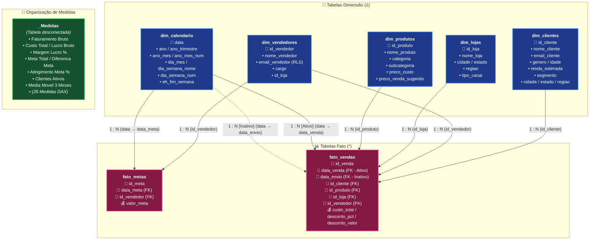

# 🏆 Guia Prático Definitivo PL-300 — Projeto Completo de Ponta a Ponta
## Microsoft Certified: Power BI Data Analyst Associate (PL-300)
### Manual Teórico, Prático, Didático e Arquitetural com Resolução Completa

---

> [!NOTE]
> **Sobre este Guia:**
> Este material foi elaborado para guiar qualquer pessoa — desde quem **nunca abriu o Power BI** até profissionais em busca da certificação **PL-300 (Microsoft Certified: Power BI Data Analyst Associate)**.
> Cada etapa explica não apenas o **como fazer** (clique a clique), mas principalmente o **porquê das coisas serem feitas daquela forma**, os impactos de performance no motor interno do Power BI (**VertiPaq**), as pegadinhas clássicas do exame da Microsoft e as alternativas para cada decisão técnica.

---

## 📑 Sumário

1. [Visão Geral do Exame PL-300 e Competências Avaliadas](#1-visão-geral-do-exame-pl-300-e-competências-avaliadas)
2. [Cenário de Negócio: Tech & Home Brasil](#2-cenário-de-negócio-tech--home-brasil)
3. [Arquitetura de Dados: Por que Usamos o Star Schema?](#3-arquitetura-de-dados-por-que-usamos-o-star-schema)
4. [Preparação do Ambiente e Conexão aos Dados](#4-preparação-do-ambiente-e-conexão-aos-dados)
5. [Etapa 1 — Preparação e Limpeza no Power Query (Linguagem M)](#5-etapa-1--preparação-e-limpeza-no-power-query-linguagem-m)
6. [Etapa 2 — Modelagem de Dados, Relacionamentos e Configurações de Tabela](#6-etapa-2--modelagem-de-dados-relacionamentos-e-configurações-de-tabela)
7. [Etapa 3 — DAX Progressivo: Explicação Profunda, Porquês e Alternativas](#7-etapa-3--dax-progressivo-explicação-profunda-porquês-e-alternativas)
   - [7.1. Fundamentos do DAX: Contextos de Linha, Filtro e Transição](#71-fundamentos-do-dax-contextos-de-linha-filtro-e-transição)
   - [7.2. Bloco 1 — Agregações Básicas e Métricas Financeiras](#72-bloco-1--agregações-básicas-e-métricas-financeiras)
   - [7.3. Bloco 2 — Modificadores de Filtro (`CALCULATE`, `ALL`, `ALLSELECTED`, `KEEPFILTERS`)](#73-bloco-2--modificadores-de-filtro-calculate-all-allselected-keepfilters)
   - [7.4. Bloco 3 — Inteligência Temporal (Time Intelligence e Variáveis)](#74-bloco-3--inteligência-temporal-time-intelligence-e-variáveis)
   - [7.5. Bloco 4 — Role-Playing Dimensions e Desempenho Operacional](#75-bloco-4--role-playing-dimensions-e-desempenho-operacional)
   - [7.6. Bloco 5 — Gestão de Metas e Funções de Ranking](#76-bloco-5--gestão-de-metas-e-funções-de-ranking)
8. [Etapa 4 — Segurança em Nível de Linha (RLS Estático e Dinâmico)](#8-etapa-4--segurança-em-nível-de-linha-rls-estático-e-dinâmico)
9. [Etapa 5 — Construção dos Relatórios, KPIs e Experiência do Usuário (UI/UX)](#9-etapa-5--construção-dos-relatórios-kpis-e-experiência-do-usuário-uiux)
10. [Etapa 6 — Publicação, Power BI Service, Gateways e Governança](#10-etapa-6--publicação-power-bi-service-gateways-e-governança)
11. [Mapeamento Completo de Tópicos do Exame PL-300](#11-mapeamento-completo-de-tópicos-do-exame-pl-300)

---

## 1. Visão Geral do Exame PL-300 e Competências Avaliadas

O exame **Microsoft PL-300: Microsoft Power BI Data Analyst** avalia a capacidade de entregar valor a partir de dados brutos utilizando o ecossistema Power BI. O exame é dividido em 4 grandes domínios com os seguintes pesos percentuais:

| Domínio de Conhecimento | Peso no Exame | O que é cobrado na prática |
|---|:---:|---|
| **1. Preparar os Dados** | **25% – 30%** | Conexão com fontes diversas, Power Query, profilagem de dados, tratamento de erros, nulos e tipos de dados, combinações (Merge/Append) e Query Folding. |
| **2. Modelar os Dados** | **25% – 30%** | Star Schema, cardinalidade e direção de filtros, tabelas de calendário, medidas DAX (agregações, filtros, Time Intelligence, iteradores), otimização de performance e RLS. |
| **3. Visualizar e Analisar os Dados** | **25% – 30%** | Seleção do visual adequado para o KPI, formatação condicional, navegação (Bookmarks/Botões), Drill-through, Tooltips customizados, visuais de IA e acessibilidade. |
| **4. Implantar e Manter Ativos** | **15% – 20%** | Workspaces e permissões (Admin, Member, Contributor, Viewer), On-premises Data Gateway, agendamento de atualizações, Dashboards, alertas de dados e compartilhamento. |

---

## 2. Cenário de Negócio: Tech & Home Brasil

A **Tech & Home Brasil** é uma rede varejista omnichannel fictícia que comercializa itens de Tecnologia, Eletrodomésticos, Móveis e Utilidades Domésticas. 

### Características Operacionais:
- **14 Lojas Físicas:** Presentes nas capitais e grandes polos das 5 regiões do Brasil (São Paulo, Rio de Janeiro, Belo Horizonte, Curitiba, Porto Alegre, Florianópolis, Salvador, Recife, Fortaleza, Brasília, Goiânia).
- **1 Canal Digital Unificado:** E-Commerce e Marketplace com alcance nacional.
- **25 Vendedores/Consultores:** Com metas mensais individuais de faturamento.
- **Base Transacional:** ~84.250 vendas realizadas entre **2023 e 2025**, totalizando mais de R$ 180 milhões em faturamento bruto.

### Dores de Negócio a Serem Resolvidas:
1. A diretoria não consegue avaliar com clareza a evolução de faturamento e lucro ano contra ano (YoY) nem mês contra mês (MoM).
2. Não há visibilidade sobre quais vendedores estão atingindo ou superando suas metas mensais.
3. A equipe de logística precisa monitorar o tempo médio de despacho (dias decorridos entre a data da venda e a data de envio).
4. O departamento de marketing precisa de uma visão detalhada do perfil dos clientes (segmento, renda estimada, idade, região).
5. É necessário restringir o acesso a dados confidenciais: gerentes regionais só podem ver lojas de sua região, e vendedores só podem ver suas próprias vendas (Segurança em Nível de Linha - RLS).

---

## 3. Arquitetura de Dados: Por que Usamos o Star Schema?

O Power BI utiliza um motor analítico colunar em memória chamado **VertiPaq**. Para extrair a máxima velocidade de processamento e a menor taxa de consumo de memória RAM, a Microsoft recomenda oficialmente a arquitetura de **Esquema Estrela (Star Schema)**.

### ❓ Por que NÃO usar uma tabela única e achatada (Flat Table)?
- **Tabelas Únicas:** Se colocássemos cliente, produto, vendedor, loja e venda em uma única tabela de 84.000 linhas, os nomes de clientes e descrições de produtos se repetiriam milhares de vezes. Isso destrói o algoritmo de compressão por dicionário do VertiPaq, consome muita memória RAM e torna as fórmulas DAX extremamente complexas e lentas.

### ❓ Por que NÃO usar o Esquema Floco de Neve (Snowflake Schema) desnecessariamente?
- **Snowflake:** Normaliza as dimensões em subdimensões (ex.: *Subcategoria* ligada a *Categoria*, ligada a *Departamento*). Cada salto de relacionamento adicional exige junções (*joins*) em tempo de execução de consulta DAX, reduzindo a performance. O Star Schema mantém as dimensões desnormalizadas (uma única tabela `dim_produtos` contendo categoria e subcategoria).

### 📐 Diagrama da Arquitetura do Modelo (Star Schema)



#### 🔗 Matriz de Relacionamentos do Modelo

| Tabela Origem (Fato) | Coluna FK | Cardinalidade | Tabela Destino (Dimensão) | Coluna PK | Direção do Filtro | Status | Observação / Caso de Uso |
| :--- | :--- | :---: | :--- | :--- | :---: | :---: | :--- |
| `fato_vendas` | `id_cliente` | `* : 1` | `dim_clientes` | `id_cliente` | Único (`dim ➔ fato`) | **Ativo** | Análise de perfil, faixa etária e segmentação |
| `fato_vendas` | `id_produto` | `* : 1` | `dim_produtos` | `id_produto` | Único (`dim ➔ fato`) | **Ativo** | Análise por categorias, subcategorias e margem |
| `fato_vendas` | `id_loja` | `* : 1` | `dim_lojas` | `id_loja` | Único (`dim ➔ fato`) | **Ativo** | Desempenho regional e vendas físicas vs digital |
| `fato_vendas` | `id_vendedor` | `* : 1` | `dim_vendedores` | `id_vendedor` | Único (`dim ➔ fato`) | **Ativo** | Comissionamento, ranking e RLS por vendedor |
| `fato_vendas` | `data_venda` | `* : 1` | `dim_calendario` | `data` | Único (`dim ➔ fato`) | **Ativo** | Inteligência temporal padrão (Vendas / YTD / SPLY) |
| `fato_vendas` | `data_envio` | `* : 1` | `dim_calendario` | `data` | Único (`dim ➔ fato`) | **Inativo** | Role-Playing Dimension ativado via `USERELATIONSHIP` |
| `fato_metas` | `id_vendedor` | `* : 1` | `dim_vendedores` | `id_vendedor` | Único (`dim ➔ fato`) | **Ativo** | Metas individuais por vendedor |
| `fato_metas` | `data_meta` | `* : 1` | `dim_calendario` | `data` | Único (`dim ➔ fato`) | **Ativo** | Metas mensais ao longo da linha do tempo |
| `_Medidas` | *N/A* | *N/A* | *N/A* | *N/A* | *N/A* | **Desconectada** | Tabela dedicada exclusivamente para repositório DAX |

### 📋 Dicionário das Tabelas:
1. **`fato_vendas` (Tabela Fato):** Armazena os eventos quantitativos de vendas (o "grão" é cada item de pedido vendido).
2. **`fato_metas` (Tabela Fato):** Armazena as metas mensais estipuladas para cada vendedor.
3. **`dim_clientes` (Tabela Dimensão):** Contém os atributos dos clientes cadastrados (quem comprou).
4. **`dim_produtos` (Tabela Dimensão):** Contém os dados dos produtos comercializados (o que foi comprado).
5. **`dim_vendedores` (Tabela Dimensão):** Contém os vendedores responsáveis pelo atendimento (quem vendeu).
6. **`dim_lojas` (Tabela Dimensão):** Informações geográficas das lojas e do e-commerce (onde foi vendido).
7. **`dim_calendario` (Tabela Dimensão de Data):** Tabela contínua de datas entre 2023 e 2025 para inteligência temporal (quando foi vendido).

---

## 4. Preparação do Ambiente e Conexão aos Dados

Você pode reproduzir este projeto utilizando **qualquer uma das duas opções abaixo**:

### Opção A: Conexão via Arquivos CSV (Mais simples, sem necessidade de banco de dados)
Ideal para quem quer começar imediatamente sem instalar softwares adicionais:
1. Abra o **Power BI Desktop**.
2. Na tela inicial ou na guia **Página Inicial (Home)**, clique em **Obter Dados (Get Data) → Texto/CSV**.
3. Navegue até a pasta `dados/` do projeto e selecione o primeiro arquivo (ex.: `dim_clientes.csv`).
4. Verifique as configurações:
   - **Origem do Arquivo:** `65001: Unicode (UTF-8)`
   - **Delimitador:** `Ponto e vírgula (;)`
5. Clique em **Transformar Dados (Transform Data)** para entrar no Editor do Power Query.
6. Dentro do Power Query, importe os demais arquivos (`dim_produtos.csv`, `dim_lojas.csv`, `dim_vendedores.csv`, `dim_calendario.csv`, `fato_metas.csv`, `fato_vendas.csv`) usando o botão **Nova Fonte → Texto/CSV**.

---

### Opção B: Conexão via Banco de Dados MySQL (Ambiente Corporativo Real)
Ideal para treinar o modo de conexão corporativa cobrado na PL-300:
1. Certifique-se de que o MySQL está rodando na sua máquina (local ou via Docker `docker compose up -d`).
2. No Power BI Desktop, vá em **Obter Dados → Mais... → Banco de Dados MySQL**.
3. Preencha os parâmetros:
   - **Servidor:** `localhost:3306` (ou `127.0.0.1:3306`)
   - **Banco de Dados:** `pl300_varejo`
   - **Modo de Conectividade de Dados:** Escolha **Importar (Import)**.
     > **💡 Por que Import e não DirectQuery?**  
     > O modo **Import** carrega os dados para a memória compactada do VertiPaq, habilitando todas as funções DAX avançadas (Time Intelligence, iteradores, variáveis) com resposta instantânea em milissegundos. O **DirectQuery** deixa os dados no banco e converte cada interação visual em uma consulta SQL nativa, limitando funções DAX e dependendo da velocidade do servidor de banco. A PL-300 recomenda Import sempre que o volume couber na memória (até centenas de milhões de linhas).
4. Na tela de credenciais: escolha a aba **Banco de Dados**, informe o usuário e senha e confirme.
5. No **Navegador (Navigator)**, marque as 7 tabelas e clique em **Transformar Dados**.

---

## 5. Etapa 1 — Preparação e Limpeza no Power Query (Linguagem M)

No exame PL-300, cerca de **30% da prova** foca em garantir que os dados cheguem limpos, bem tipados e otimizados ao modelo.

---

### 🧪 Exercício 1.1: Ativação da Profilagem de Dados (Data Profiling)

A profilagem de dados permite identificar visualmente anomalias, dados faltantes (nulos) e valores discrepantes antes de carregar as tabelas.

#### Como fazer:
1. Na barra superior do Power Query, clique na guia **Exibição (View)**.
2. Marque as 3 opções do grupo **Visualização de Dados**:
   - ✅ **Qualidade da Coluna (Column Quality):** Mostra a porcentagem de valores Válidos (verde), Erros (vermelho) e Vazios (cinza).
   - ✅ **Distribuição de Colunas (Column Distribution):** Apresenta a contagem de valores distintos (quantos valores únicos existem) e exclusivos (valores que aparecem exatamente 1 vez).
   - ✅ **Perfil da Coluna (Column Profile):** Exibe um painel inferior com estatísticas completas (Mínimo, Máximo, Média, Desvio Padrão, Quantidade de Pares/Ímpares).
3. **⚠️ Ponto Crítico PL-300:** Por padrão, o Power Query analisa apenas as **primeiras 1.000 linhas**. No canto inferior esquerdo da tela (barra de status), clique no texto *"Criação de perfil de coluna com base nas 1.000 linhas principais"* e mude para **"Com base no conjunto de dados inteiro" (Column profiling based on entire dataset)**.

```
+-------------------------------------------------------------------------+
| [View / Exibição] -> [X] Column Quality  [X] Column Distribution        |
|-------------------------------------------------------------------------|
| nome_cliente                     | renda_estimada                       |
| Valid: 100% | Error: 0% | Empty: 0% | Valid: 98% | Error: 0% | Empty: 2%   |
| [||||||||||||||||||||||||||||||] | [||||||||||||||||||||||||||||  ]     |
| 1.200 Distinct, 1.200 Unique     | Min: 1.500 | Max: 35.000 | Med: 7.800|
+-------------------------------------------------------------------------+
```

---

### 🧪 Exercício 1.2: Limpeza e Padronização da Tabela `dim_clientes`

Na base de dados, a coluna `nome_cliente` contém espaçamentos indesejados e letras maiúsculas/minúsculas fora de padrão.

#### Passo a passo e Porquês:
1. Selecione a coluna `nome_cliente`.
2. Vá na guia **Transformar (Transform) → Formatar (Format) → Cortar (Trim)**.
   - *Por que:* Remove espaços em branco antes do primeiro caractere e depois do último caractere (ex.: `" Carlos Souza "` vira `"Carlos Souza"`). Espaços invisíveis quebram relacionamentos e duplicam itens em agrupamentos.
3. Vá em **Transformar → Formatar → Limpar (Clean)**.
   - *Por que:* Remove caracteres não imprimíveis (como quebras de linha `\n`, `\r` ou caracteres de controle ASCII de 0 a 31 que costumam vir de integrações com sistemas legados).
4. Vá em **Transformar → Formatar → Colocar Cada Palavra em Maiúscula (Capitalize Each Word)**.
   - *Por que:* Padroniza nomes próprios para uma estética visual profissional nos relatórios.
5. Verifique a coluna `renda_estimada`:
   - Clique no ícone do tipo de dados à esquerda do cabeçalho da coluna e selecione **Número Decimal Fixo (Fixed Decimal Number)**.
   - *Por que:* O formato de decimal fixo utiliza 4 casas decimais e evita imprecisões de arredondamento causadas pela representação em ponto flutuante do tipo *Número Decimal*.

---

### 🧪 Exercício 1.3: Tratamento de Nulos e Inconsistências na `fato_vendas`

#### 1. Tratamento da coluna `desconto_pct`:
- Na `fato_vendas`, quando uma venda não teve desconto, o valor gravado foi `null` (vazio).
- Clique com o botão direito no cabeçalho de `desconto_pct` → **Substituir Valores (Replace Values)**.
  - *Valor a ser Localizado:* Deixe em branco (representa o `null`).
  - *Substituir por:* `0`
- Altere o tipo da coluna para **Número Decimal** ou **Porcentagem**.
- *Por que:* Em cálculos DAX de média ou em colunas numéricas, valores `null` podem se comportar como ausência de dados, enquanto comercialmente o desconto concedido foi formalmente de **0%**.

#### 2. Tratamento da coluna `status_entrega`:
- Alguns status vieram em minúsculo (`"entregue"`) e outros com valor `null`.
- Selecione a coluna `status_entrega` → **Transformar → Formatar → Colocar Cada Palavra em Maiúscula**.
- Clique com o botão direito → **Substituir Valores**:
  - *Valor a ser Localizado:* Deixe em branco (`null`).
  - *Substituir por:* `"Não Informado"`.
- *Por que:* Em filtros e segmentadores de dados, um valor vazio aparece como `(Em branco)`, o que confunde o usuário executivo. Substituir por um texto claro melhora a experiência de navegação.

#### 3. Tipagem das colunas financeiras (`preco_unitario`, `valor_liquido`, `custo_total`, `valor_bruto`):
- Selecione as 4 colunas → clique com o botão direito → **Alterar Tipo → Número Decimal Fixo (Moeda)**.

---

### 🧪 Exercício 1.4: Boas Práticas, Pastas e Parâmetros

Para manter um projeto profissional e pontuar nas questões de governança do exame:

1. **Organização em Grupos (Pastas de Consultas):**
   - No painel esquerdo do Power Query (*Consultas*), clique com o botão direito no espaço vazio → **Novo Grupo (New Group)**.
   - Crie a seguinte estrutura:
     - 📁 **01 - Parâmetros & Configurações**
     - 📁 **02 - Dimensões** (mova `dim_clientes`, `dim_produtos`, `dim_lojas`, `dim_vendedores`, `dim_calendario`)
     - 📁 **03 - Fatos** (mova `fato_vendas`, `fato_metas`)
2. **Criação de um Parâmetro de Ambiente (`pAmbiente`):**
   - Na guia *Página Inicial*, clique em **Gerenciar Parâmetros → Novo Parâmetro**.
   - Nome: `pAmbiente`
   - Tipo: `Texto`
   - Valores Sugeridos: `Lista de Valores` (`"Desenvolvimento"`, `"Homologacao"`, `"Producao"`)
   - Valor Atual: `"Producao"`
   - *Por que isso é cobrado na PL-300:* Parâmetros permitem trocar a string de conexão do banco de dados ou a pasta dos arquivos em lote sem precisar alterar o código de cada consulta individualmente.
3. **Desabilitar Carga de Consultas Intermediárias (Enable Load):**
   - Se você criar uma consulta de apoio que serve apenas para ser mesclada em outra tabela, clique com o botão direito sobre ela e desmarque **Habilitar Carga (Enable Load)**.
   - *Por que:* Tabelas com carga desabilitada continuam disponíveis para transformações no Power Query, mas **não consom memória RAM** no modelo de dados final.

Ao finalizar as transformações, clique no botão **Página Inicial → Fechar e Aplicar (Close & Apply)**.

---

## 6. Etapa 2 — Modelagem de Dados, Relacionamentos e Configurações de Tabela

Vá para a **Exibição de Modelo (Model View)** no painel lateral esquerdo do Power BI Desktop (ícone de três caixas conectadas).

---

### 🧪 Exercício 2.1: Criação dos Relacionamentos no Esquema Estrela

Arraste o campo da tabela dimensão (lado 1) até o campo correspondente da tabela fato (lado N / Muitos).

| Tabela 1 (Dimensão) | Campo Chave   | Tabela N (Fato) | Chave Estrangeira | Cardinalidade       | Direção Filtro Cruzado |   Estado    |
| ------------------- | ------------- | --------------- | ----------------- | ------------------- | ---------------------- | :---------: |
| `dim_clientes`      | `id_cliente`  | `fato_vendas`   | `id_cliente`      | 1 para Muitos (1:*) | Único (Single)         |  **Ativo**  |
| `dim_produtos`      | `id_produto`  | `fato_vendas`   | `id_produto`      | 1 para Muitos (1:*) | Único (Single)         |  **Ativo**  |
| `dim_lojas`         | `id_loja`     | `fato_vendas`   | `id_loja`         | 1 para Muitos (1:*) | Único (Single)         |  **Ativo**  |
| `dim_vendedores`    | `id_vendedor` | `fato_vendas`   | `id_vendedor`     | 1 para Muitos (1:*) | Único (Single)         |  **Ativo**  |
| `dim_calendario`    | `data`        | `fato_vendas`   | `data_venda`      | 1 para Muitos (1:*) | Único (Single)         |  **Ativo**  |
| `dim_calendario`    | `data`        | `fato_vendas`   | `data_envio`      | 1 para Muitos (1:*) | Único (Single)         | **Inativo** |
| `dim_vendedores`    | `id_vendedor` | `fato_metas`    | `id_vendedor`     | 1 para Muitos (1:*) | Único (Single)         |  **Ativo**  |
| `dim_calendario`    | `data`        | `fato_metas`    | `data_meta`       | 1 para Muitos (1:*) | Único (Single)         |  **Ativo**  |

#### ⚠️ Por que a Direção do Filtro Cruzado DEVE ser Única (Single)?
- **Filtro Bidirecional (Both):** Faz com que os filtros da tabela fato fluam de volta para as dimensões. Isso cria caminhos ambíguos no grafo do modelo, gera resultados matemáticos errados em agregações complexas e degrada drasticamente a velocidade de renderização dos visuais. Na PL-300, a regra de ouro é: **mantenha sempre a direção como Única (1 → N)**, salvo raras exceções de segurança dinâmica.

#### ⚠️ Role-Playing Dimensions e Relacionamentos Inativos:
- A `fato_vendas` possui duas datas: a data em que o pedido foi feito (`data_venda`) e a data em que o produto foi despachado (`data_envio`).
- O Power BI não permite dois relacionamentos ativos entre o mesmo par de tabelas para evitar ambiguidade.
- Por isso, o relacionamento entre `dim_calendario[data]` e `fato_vendas[data_envio]` fica **Inativo** (linha pontilhada). Ele será ativado sob demanda exclusivamente dentro de fórmulas DAX específicas através da função `USERELATIONSHIP()`.

---

### 🧪 Exercício 2.2: Marcar como Tabela de Datas Oficial (Mark as Date Table)

#### O que o Power BI faz por padrão:
Quando você importa uma coluna de data, o Power BI cria internamente uma tabela de calendário oculta para cada coluna de data do seu modelo (*Auto Date/Time*). Se você tiver 10 colunas de data em várias tabelas, terá 10 tabelas ocultas gerando hierarquias automáticas, inflando o tamanho do arquivo `.pbix` em até 300%.

#### Como resolver:
1. Na Exibição de Tabela ou Modelo, clique com o botão direito na tabela `dim_calendario`.
2. Selecione **Marcar como Tabela de Datas (Mark as Date Table) → Marcar como tabela de datas**.
3. No seletor de coluna, escolha a coluna `data` e confirme clicando em **OK**.

#### Por que isso é vital:
- Desativa as tabelas automáticas ocultas.
- Garante integridade temporal para todas as funções de **Time Intelligence** do DAX (`SAMEPERIODLASTYEAR`, `TOTALYTD`, `DATESINPERIOD`).

---

### 🧪 Exercício 2.3: Configurar Classificação por Coluna (Sort by Column)

Por padrão, se você colocar o campo `nome_mes` em um gráfico, o Power BI ordenará os meses por ordem alfabética (*"Abril", "Agosto", "Dezembro", "Fevereiro"...*).

#### Como configurar a ordenação correta:
1. Na tabela `dim_calendario`, clique na coluna `nome_mes` (ou `mes_curto`).
2. Na faixa de opções superior, abra a guia **Ferramentas de Coluna (Column Tools)**.
3. Clique em **Classificar por Coluna (Sort by Column)** e escolha a coluna `num_mes` (1, 2, 3... 12).
4. Repita para as outras colunas de texto com ordem lógica:
   - `dia_semana_nome` → Classificar por `dia_semana_num`
   - `ano_mes` → Classificar por `ano_mes_num`

---

### 🧪 Exercício 2.4: Categorização de Dados Geográficos (Data Category)

Por padrão, colunas de texto geográficas são importadas como *Não categorizado*. Para que o Bing/Azure Maps localize os pontos com precisão absoluta (evitando que siglas como `SC` sejam mapeadas para a Carolina do Sul nos EUA):
1. Na tabela `dim_lojas`, selecione a coluna `cidade`.
2. Na faixa superior, abra a guia **Ferramentas de Coluna (Column Tools)**.
3. No campo **Categoria de Dados (Data Category)**, selecione **Cidade (City)**. Um ícone de globo 🌐 aparecerá ao lado da coluna.
4. *(Opcional)* Na coluna `estado`, defina a Categoria de Dados como **Estado ou Província (State or Province)**.

---

### 🧪 Exercício 2.5: Ocultação de Chaves Técnicas e Criação da Tabela `_Medidas`

1. **Ocultar Chaves Estrangeiras:**
   - Na `fato_vendas`, selecione as colunas `id_cliente`, `id_produto`, `id_vendedor`, `id_loja` → clique com o botão direito → **Ocultar na Exibição de Relatório (Hide in report view)**.
   - *Por que:* O usuário final de negócios nunca deve arrastar o `id_cliente` da tabela fato para um visual para tentar somar. Todas as análises descritivas devem vir das tabelas dimensões.
2. **Criar a Tabela Dedicada a Medidas:**
   - Na guia *Página Inicial*, clique em **Inserir Dados (Enter Data)**.
   - Nome da tabela: `_Medidas` (o sublinhado `_` garante que ela fique no topo da lista alfabética).
   - Clique em **Carregar**.

---

## 7. Etapa 3 — DAX Progressivo: Explicação Profunda, Porquês e Alternativas

Crie todas as medidas a seguir dentro da tabela `_Medidas`.

---

### 7.1. Fundamentos do DAX: Contextos de Linha, Filtro e Transição

Para dominar DAX e passar na PL-300, você precisa compreender os três conceitos fundamentais:

1. **Contexto de Filtro (Filter Context):** É o conjunto de filtros ativos no momento em que a fórmula é calculada. Ele vem dos filtros de página, segmentadores de dados (slicers), filtros do painel lateral e do próprio visual (linhas e colunas de uma matriz).
2. **Contexto de Linha (Row Context):** Existe nativamente apenas em colunas calculadas ou dentro de funções iteradoras (`SUMX`, `AVERAGEX`, `FILTER`). Ele sabe em qual linha específica da tabela está operando, mas **não aplica filtros** automaticamente nas outras tabelas.
3. **Transição de Contexto (Context Transition):** Ocorre quando invocamos a função `CALCULATE` (ou chamamos uma medida que implicitamente executa um `CALCULATE`) dentro de um contexto de linha. O `CALCULATE` transforma o contexto daquela linha atual em um contexto de filtro equivalente para todo o modelo.

---

### 7.2. Bloco 1 — Agregações Básicas e Métricas Financeiras

```dax
// -------------------------------------------------------------
// 1. Faturamento Bruto
// -------------------------------------------------------------
Faturamento Bruto = SUM(fato_vendas[valor_bruto])
```
* **O que faz:** Soma o valor financeiro bruto total de todos os itens registrados na tabela fato sob o contexto de filtro atual.
* **Por que foi feita assim:** A função `SUM` opera diretamente sobre uma única coluna do VertiPaq, aproveitando a compressão colunar nativa para responder em microssegundos.
* **Alternativa:** `SUMX(fato_vendas, fato_vendas[quantidade] * fato_vendas[preco_unitario])`.  
  *Comparação:* A versão com `SUMX` seria necessária se a coluna `valor_bruto` não existisse fisicamente na tabela. Como já temos a coluna calculada na fonte/Power Query, o `SUM` simples é computacionalmente mais leve e eficiente.

---

```dax
// -------------------------------------------------------------
// 2. Receita Líquida (Faturamento Real)
// -------------------------------------------------------------
Receita Liquida = SUM(fato_vendas[valor_liquido])
```
* **O que faz:** Representa o faturamento real da empresa após a dedução dos descontos comerciais concedidos nas transações.
* **Por que foi feita assim:** É o KPI central do negócio (*North Star Metric*), servindo de base para todos os cálculos de margem, crescimento e atingimento de metas.

---

```dax
// -------------------------------------------------------------
// 3. Custo Total das Mercadorias Vendidas (CMV)
// -------------------------------------------------------------
Custo Total = SUM(fato_vendas[custo_total])
```
* **O que faz:** Consolida o custo de aquisição/fabricação dos produtos que foram efetivamente comercializados.

---

```dax
// -------------------------------------------------------------
// 4. Lucro Bruto
// -------------------------------------------------------------
Lucro Bruto = [Receita Liquida] - [Custo Total]
```
* **O que faz:** Calcula o ganho financeiro bruto da empresa (`Receita Líquida - Custo Total`).
* **Por que foi feita assim (Measure Branching / Encadeamento de Medidas):** Ao invés de escrever `SUM(fato_vendas[valor_liquido]) - SUM(fato_vendas[custo_total])`, reutilizamos as medidas `[Receita Liquida]` e `[Custo Total]`.
* **Vantagens de Reutilizar Medidas:** 
  1. Se a regra de negócio da Receita mudar no futuro, alteramos apenas a medida original e todos os relatórios herdam a correção.
  2. Garante a execução da *Transição de Contexto* automática quando a medida for invocada dentro de iteradores.

---

```dax
// -------------------------------------------------------------
// 5. Margem de Lucro %
// -------------------------------------------------------------
Margem Lucro % = 
DIVIDE(
    [Lucro Bruto],
    [Receita Liquida],
    0
)
```
* **O que faz:** Retorna a rentabilidade percentual das vendas (`Lucro Bruto / Receita Líquida`).
* **Por que usamos `DIVIDE()` em vez do operador barra `/`:**
  - Se a `[Receita Liquida]` for zero (ou `null`), o operador `[Lucro Bruto] / [Receita Liquida]` causaria o erro `#DIV/0!` ou retornaria `Infinity`, quebrando os visuais de cartões e gráficos.
  - A função `DIVIDE(Numerador, Denominador, [ValorAlternativo])` captura nativamente divisões por zero e casos nulos (`0 / 0`), retornando com segurança o terceiro argumento (`0` ou `BLANK`).

---

```dax
// -------------------------------------------------------------
// 6. Quantidade Total de Itens Vendidos
// -------------------------------------------------------------
Qtd Itens Vendidos = SUM(fato_vendas[quantidade])
```
* **O que faz:** Contabiliza o volume físico de unidades de produtos vendidas.

---

```dax
// -------------------------------------------------------------
// 7. Total de Pedidos Únicos
// -------------------------------------------------------------
Total Pedidos = DISTINCTCOUNT(fato_vendas[id_venda])
```
* **O que faz:** Conta quantas transações/pedidos únicos foram emitidos.
* **Por que usar `DISTINCTCOUNT`:** Em um varejo, um único pedido (`id_venda = 1050`) pode conter 4 produtos diferentes, gerando 4 linhas na tabela `fato_vendas`. A função `COUNTROWS(fato_vendas)` contaria 4 linhas, mas o número real de pedidos realizados foi apenas 1. `DISTINCTCOUNT` ignora repetições do mesmo ID.
* **Alternativa:** `COUNTROWS(DISTINCT(fato_vendas[id_venda]))` ou `DISTINCTCOUNTNOBLANK()`. A função `DISTINCTCOUNT` direta é a mais performática e legível.

---

```dax
// -------------------------------------------------------------
// 8. Ticket Médio por Pedido
// -------------------------------------------------------------
Ticket Medio = 
DIVIDE(
    [Receita Liquida],
    [Total Pedidos],
    0
)
```
* **O que faz:** Informa qual o valor médio gasto pelos clientes em cada compra efetuada.

---

```dax
// -------------------------------------------------------------
// 9. Total de Clientes Ativos
// -------------------------------------------------------------
Clientes Ativos = DISTINCTCOUNT(fato_vendas[id_cliente])
```
* **O que faz:** Conta quantos clientes distintos realizaram compras dentro do período e filtros selecionados.

---

### 7.3. Bloco 2 — Modificadores de Filtro (`CALCULATE`, `ALL`, `ALLSELECTED`, `KEEPFILTERS`)

> [!IMPORTANT]
> A função `CALCULATE(Expressao, Filtro1, Filtro2, ...)` é a função mais poderosa e mais cobrada de todo o DAX. Ela é a **única função capaz de modificar o contexto de filtro** de uma expressão.

```dax
// -------------------------------------------------------------
// 10. Faturamento Total Geral (Denominador Estático)
// -------------------------------------------------------------
Receita Total Geral = 
CALCULATE(
    [Receita Liquida],
    ALL(fato_vendas)
)
```
* **O que faz:** Retorna a receita de toda a tabela de vendas, ignorando quaisquer filtros aplicados em relatórios, segmentadores ou linhas de tabelas.
* **Por que usamos `ALL()`:** A função `ALL(tabela)` remove todos os filtros aplicados à tabela indicada.
* **Alternativa Moderna (Recomendada pela Microsoft):**
  ```dax
  Receita Total Geral = 
  CALCULATE(
      [Receita Liquida],
      REMOVEFILTERS(fato_vendas)
  )
  ```
  *Diferença:* `REMOVEFILTERS` é um modificador de filtro explícito para uso dentro de `CALCULATE`, deixando a intenção do desenvolvedor 100% clara, enquanto `ALL` pode atuar tanto como modificador de filtro quanto como função de tabela que retorna linhas.

---

```dax
// -------------------------------------------------------------
// 11. % de Participação no Faturamento (Share of Wallet / Market Share)
// -------------------------------------------------------------
Share Receita % = 
DIVIDE(
    [Receita Liquida],
    CALCULATE([Receita Liquida], ALLSELECTED(dim_produtos)),
    0
)
```
* **O que faz:** Em uma tabela que lista as categorias de produtos, calcula quanto cada categoria representa (ex.: *Tecnologia = 45%*, *Eletrodomésticos = 30%*), somando exatamente 100%.
* **Por que usamos `ALLSELECTED()` em vez de `ALL()`:**
  - `ALL(dim_produtos)` removeria absolutamente todos os filtros de produtos, inclusive aqueles que o usuário selecionou voluntariamente em um segmentador de tela.
  - `ALLSELECTED(dim_produtos)` remove o filtro da **linha atual do gráfico**, mas **respeita os filtros externos** (slicers de ano, filtros de página ou filtros de categoria selecionados pelo usuário).

---

```dax
// -------------------------------------------------------------
// 12. Receita Somente de Canais Online / E-Commerce
// -------------------------------------------------------------
Receita Online = 
CALCULATE(
    [Receita Liquida],
    dim_lojas[tipo_canal] = "Online"
)
```
* **O que faz:** Injeta um filtro fixo para calcular apenas as vendas originadas pelo canal `"Online"`.
* **Como o DAX processa isso internamente:** O DAX converte a expressão booleana `dim_lojas[tipo_canal] = "Online"` em uma tabela de filtro:
  `FILTER(ALL(dim_lojas[tipo_canal]), dim_lojas[tipo_canal] = "Online")`.

---

```dax
// -------------------------------------------------------------
// 13. Receita com Desconto Elevado (> 10%)
// -------------------------------------------------------------
Receita Desconto Alto = 
CALCULATE(
    [Receita Liquida],
    KEEPFILTERS(fato_vendas[desconto_pct] > 0.10)
)
```
* **O que faz:** Calcula a receita filtrando apenas as linhas onde o desconto concedido superou 10%.
* **Por que usamos `KEEPFILTERS()`:** 
  - Por padrão, filtros passados dentro de `CALCULATE` **substituem** quaisquer filtros preexistentes na mesma coluna.
  - A função `KEEPFILTERS` força o DAX a somar (fazer a interseção lógica `AND`) o filtro do `CALCULATE` com os filtros já existentes na visualização, evitando que filtros de usuário sejam sobrescritos acidentalmente.

---

### 7.4. Bloco 3 — Inteligência Temporal (Time Intelligence e Variáveis)

> [!WARNING]
> **Requisitos Obrigatórios para Funções de Time Intelligence funcionarem sem erro:**
> 1. Ter uma tabela `dim_calendario` com **todas as datas contínuas** (sem buracos/dias faltantes entre o primeiro e o último dia).
> 2. Marcar a tabela de calendário como **Tabela Oficial de Datas** no modelo.
> 3. Usar sempre a coluna de data da tabela calendário (`dim_calendario[data]`), **NUNCA** a coluna de data da tabela fato (`fato_vendas[data_venda]`).

```dax
// -------------------------------------------------------------
// 14. Receita Acumulada no Ano (Year-To-Date / YTD)
// -------------------------------------------------------------
Receita YTD = 
TOTALYTD(
    [Receita Liquida],
    dim_calendario[data]
)
```
* **O que faz:** Acumula a receita a partir de 1º de janeiro do ano avaliado até o dia/mês atual selecionado no contexto. Em março, por exemplo, o YTD traz a soma de Janeiro + Fevereiro + Março.
* **Alternativa:**
  ```dax
  Receita YTD = 
  CALCULATE(
      [Receita Liquida],
      DATESYTD(dim_calendario[data])
  )
  ```
  *Comparação:* `TOTALYTD` é um atalho de sintaxe (*syntax sugar*) para `CALCULATE + DATESYTD`. Ambas têm desempenho idêntico no motor VertiPaq.

---

```dax
// -------------------------------------------------------------
// 15. Receita do Mesmo Período do Ano Anterior (Same Period Last Year / SPLY)
// -------------------------------------------------------------
Receita SPLY = 
CALCULATE(
    [Receita Liquida],
    SAMEPERIODLASTYEAR(dim_calendario[data])
)
```
* **O que faz:** Desloca o período de datas filtrado exatamente 1 ano para o passado. Se o relatório estiver filtrando *Agosto de 2024*, `SAMEPERIODLASTYEAR` retornará as vendas de *Agosto de 2023*.
* **Alternativa Equivalente:**
  ```dax
  Receita SPLY = 
  CALCULATE(
      [Receita Liquida],
      DATEADD(dim_calendario[data], -1, YEAR)
  )
  ```
  *Comparação:* `SAMEPERIODLASTYEAR` é uma função específica para recuo anual. `DATEADD` é mais versátil, pois permite navegar períodos variáveis em dias, meses, trimestres ou anos (`DATEADD(data, -3, MONTH)` para 3 meses atrás).

---

```dax
// -------------------------------------------------------------
// 16. Variação Ano contra Ano em Valor (YoY Valor)
// -------------------------------------------------------------
Variacao YoY Valor = [Receita Liquida] - [Receita SPLY]
```
* **O que faz:** Mostra em reais quanto a empresa cresceu ou retraiu em relação ao mesmo período do ano anterior.

---

```dax
// -------------------------------------------------------------
// 17. Variação Percentual Ano contra Ano (YoY %)
// -------------------------------------------------------------
Variacao YoY % = 
DIVIDE(
    [Variacao YoY Valor],
    [Receita SPLY],
    0
)
```
* **O que faz:** Calcula o crescimento percentual anual (`(Atual - Anterior) / Anterior`).

---

```dax
// -------------------------------------------------------------
// 18. Receita do Mês Anterior (Month-over-Month / MoM)
// -------------------------------------------------------------
Receita Mes Anterior = 
CALCULATE(
    [Receita Liquida],
    PREVIOUSMONTH(dim_calendario[data])
)
```
* **O que faz:** Retorna o faturamento do mês civil imediatamente anterior.

---

```dax
// -------------------------------------------------------------
// 19. Variação Percentual Mês contra Mês (MoM %) com Variáveis (VAR / RETURN)
// -------------------------------------------------------------
Variacao MoM % = 
VAR _Atual = [Receita Liquida]
VAR _Anterior = [Receita Mes Anterior]
VAR _Resultado = 
    DIVIDE(_Atual - _Anterior, _Anterior, 0)
RETURN
    _Resultado
```
* **O que faz:** Calcula a evolução percentual de faturamento em relação ao mês anterior.
* **Por que usar Variáveis (`VAR` / `RETURN`):**
  1. **Performance:** Variáveis armazenam o resultado do cálculo na memória. Sem variáveis, se escrevêssemos `DIVIDE([Receita Liquida] - [Receita Mes Anterior], [Receita Mes Anterior])`, o DAX avaliaria a medida `[Receita Mes Anterior]` duas vezes no processador.
  2. **Legibilidade e Depuração:** Permite testar etapas isoladas da fórmula alterando apenas o retorno final para `RETURN _Anterior`.
  3. **Congelamento de Contexto:** A variável avalia a expressão no momento em que é declarada, mantendo o resultado imutável no restante da execução.

---

```dax
// -------------------------------------------------------------
// 20. Média Móvel dos Últimos 3 Meses (Rolling 3 Months Average)
// -------------------------------------------------------------
Media Movel 3 Meses = 
AVERAGEX(
    DATESINPERIOD(
        dim_calendario[data],
        MAX(dim_calendario[data]),
        -3,
        MONTH
    ),
    [Receita Liquida]
)
```
* **O que faz:** Suaviza a curva de sazonalidade calculando a média de vendas de uma janela deslizante dos 3 meses mais recentes a partir da data em foco.
* **Como funciona:**
  1. `MAX(dim_calendario[data])` captura a data final do período atual.
  2. `DATESINPERIOD(data, data_fim, -3, MONTH)` gera uma tabela de datas compreendendo os últimos 3 meses.
  3. `AVERAGEX(tabela_datas, [Receita Liquida])` itera dia a dia ou mês a mês calculando a receita líquida e tirando a média aritmética.

---

### 7.5. Bloco 4 — Role-Playing Dimensions e Desempenho Operacional

```dax
// -------------------------------------------------------------
// 21. Receita pela Data de Envio (Ativando Relacionamento Inativo)
// -------------------------------------------------------------
Receita por Data de Envio = 
CALCULATE(
    [Receita Liquida],
    USERELATIONSHIP(fato_vendas[data_envio], dim_calendario[data])
)
```
* **O que faz:** Calcula o faturamento considerando o momento em que os produtos foram **despachados da expedição/loja**, e não quando o pedido foi criado no sistema.
* **Por que usamos `USERELATIONSHIP()`:**
  - O relacionamento ativo do modelo é `dim_calendario[data] -> fato_vendas[data_venda]`.
  - Para analisar entregas por data de despacho sem precisar duplicar a tabela de calendário no Power Query, instruímos o `CALCULATE` a desativar temporariamente o relacionamento de venda e ativar o relacionamento de `data_envio`.
* **Alternativa Ruim:** Duplicar a tabela `dim_calendario` para criar uma `dim_calendario_envio`. Isso dobraria a quantidade de colunas de datas no modelo e confundiria os usuários nos filtros.

---

```dax
// -------------------------------------------------------------
// 22. Tempo Médio de Despacho em Dias (Lead Time Logístico)
// -------------------------------------------------------------
Tempo Medio Despacho Dias = 
AVERAGEX(
    fato_vendas,
    DATEDIFF(fato_vendas[data_venda], fato_vendas[data_envio], DAY)
)
```
* **O que faz:** Mede a eficiência operacional da expedição, informando a média de dias que a mercadoria leva para sair do estoque após o pedido ser aprovado.
* **Como funciona:** `AVERAGEX` cria um contexto de linha na tabela `fato_vendas`, calcula a diferença em dias com `DATEDIFF` linha por linha e tira a média geral no final.

---

### 7.6. Bloco 5 — Gestão de Metas e Funções de Ranking

```dax
// -------------------------------------------------------------
// 23. Meta Total de Vendas
// -------------------------------------------------------------
Meta Total = SUM(fato_metas[valor_meta])
```
* **O que faz:** Agrega os valores de metas comerciais estipulados na tabela `fato_metas`.

---

```dax
// -------------------------------------------------------------
// 24. Diferença / Gap de Meta
// -------------------------------------------------------------
Diferenca Meta = [Receita Liquida] - [Meta Total]
```
* **O que faz:** Mostra em valor absoluto se a operação está superavitária (positivo) ou deficitária (negativo) em relação ao planejado.

---

```dax
// -------------------------------------------------------------
// 25. Percentual de Atingimento da Meta
// -------------------------------------------------------------
Atingimento Meta % = 
DIVIDE(
    [Receita Liquida],
    [Meta Total],
    0
)
```
* **O que faz:** Retorna o percentual de cumprimento da meta (ex.: `1.15` = 115% da meta batida; `0.85` = 85% atingido).

---

```dax
// -------------------------------------------------------------
// 26. Ranking Dinâmico de Vendedores por Faturamento
// -------------------------------------------------------------
Ranking Vendedor = 
IF(
    ISINSCOPE(dim_vendedores[nome_vendedor]),
    RANKX(
        ALLSELECTED(dim_vendedores[nome_vendedor]),
        [Receita Liquida],
        ,
        DESC,
        Dense
    )
)
```
* **O que faz:** Classifica os vendedores do 1º ao 25º lugar em ordem decrescente de faturamento.
* **Por que usamos `ISINSCOPE()`:** 
  - Sem `ISINSCOPE`, a linha de "Total Geral" de uma tabela tentaria ranquear a si mesma e mostraria `1` no total geral da matriz. `ISINSCOPE` verifica se o campo `nome_vendedor` está ativamente no nível da linha que está sendo desenhada.
* **Por que usar `Dense` no 5º argumento:** 
  - `Dense` garante que, se dois vendedores empatarem na 2ª posição, o próximo vendedor receberá a posição 3 (e não pulará para a posição 4 como no modo `Skip`).

---

## 8. Etapa 4 — Segurança em Nível de Linha (RLS Estático e Dinâmico)

A Segurança em Nível de Linha (*Row-Level Security - RLS*) garante que diferentes usuários acessem o mesmo relatório, mas visualizem apenas as fatias de dados para as quais possuem autorização.

---

### 🧪 Exercício 4.1: RLS Estático por Região Geográfica

O RLS Estático é utilizado quando as regras de negócio são fixas por grupos funcionais (ex.: Gerentes Regionais).

#### Passo a passo de criação:
1. No Power BI Desktop, vá na guia **Modelagem (Modeling) → Gerenciar Funções (Manage Roles)**.
2. Clique no botão **Criar (Create)** e dê o nome: `Gerente_Sul`.
3. Selecione a tabela `dim_lojas`.
4. No editor de filtro DAX, digite:
   ```dax
   [regiao] = "Sul"
   ```
5. Clique em Criar para uma segunda função: `Gerente_Sudeste`:
   ```dax
   [regiao] = "Sudeste"
   ```
6. Salve as funções clicando em **Salvar**.

#### Como validar o RLS no Power BI Desktop:
1. Na guia *Modelagem*, clique no botão **Exibir como (View as)**.
2. Marque a caixa `Gerente_Sul` e clique em **OK**.
3. Observe que o relatório inteiro é recalculado instantaneamente, exibindo apenas as lojas de Curitiba, Porto Alegre e Florianópolis. No topo da tela surgirá uma barra amarela indicando que você está simulando o papel.
4. Para retornar à visualização normal, clique em **Parar Visualização**.

---

### 🧪 Exercício 4.2: RLS Dinâmico com `USERPRINCIPALNAME()`

O RLS Dinâmico utiliza a identidade do usuário logado na nuvem (conta Microsoft corporativa) para filtrar a tabela automaticamente, sem precisar criar dezenas de papéis manuais.

#### Passo a passo de criação:
1. Em **Gerenciar Funções**, clique em Criar e nomeie a função: `Vendedor_Logado`.
2. Selecione a tabela `dim_vendedores`.
3. Digite a expressão DAX:
   ```dax
   [email_vendedor] = USERPRINCIPALNAME()
   ```
4. Salve a função.

#### 💡 Diferença entre `USERPRINCIPALNAME()` e `USERNAME()`:
- `USERNAME()`: Retorna `DOMINIO\usuario` no Power BI Desktop e o e-mail no Power BI Service.
- `USERPRINCIPALNAME()`: Retorna **sempre o endereço de e-mail corporativo** (`usuario@empresa.com.br`) em formato UPN padrão tanto no Desktop quanto no Service na nuvem. A Microsoft recomenda oficialmente o uso de `USERPRINCIPALNAME()` para regras de RLS dinâmico.

#### Como testar o RLS Dinâmico:
1. Clique em **Exibir como (View as)**.
2. Marque a função `Vendedor_Logado`.
3. Marque a caixa de seleção **Outro usuário (Other user)**.
4. Digite o e-mail de um vendedor cadastrado na base: `carlos.drummond@empresa.com.br`
5. Clique em **OK**. O Power BI simulará exatamente a visão que o vendedor Carlos Drummond terá ao abrir o relatório no portal corporativo.

---

## 9. Etapa 5 — Construção dos Relatórios, KPIs e Experiência do Usuário (UI/UX)

Construiremos 3 painéis interativos organizados de forma hierárquica.

---

### 📊 Painel 1: Visão Executiva de Performance Financeira

**Objetivo de Negócio:** Oferecer aos C-levels (CEO, CFO, Diretores) um panorama rápido do faturamento, lucros e expansão geográfica.

```
+------------------------------------------------------------------------------------+
|  [Tech & Home Brasil] — Dashboard Executivo de Vendas           [Slicer: Ano | Região]
+------------------------------------------------------------------------------------+
| [ Card KPI 1 ]   | [ Card KPI 2 ]   | [ Card KPI 3 ]   | [ Card KPI 4 ]            |
| Receita Líquida  | Lucro Bruto      | Margem %         | Variação YoY %            |
| R$ 184,2 M       | R$ 78,5 M        | 42,6%            | + 18,4% ▲ (Verde)         |
+------------------------------------------------------------------------------------+
| [ Gráfico de Linhas / Área ]                     | [ Gráfico de Barras Horizontais ]|
| Evolução Mensal: Realizado x SPLY (Ano Anterior) | Receita por Categoria de Produto|
+------------------------------------------------------------------------------------+
| [ Mapa de Formas / Preenchido ]                  | [ Gráfico de Rosca / Donut ]    |
| Faturamento por UF (SP, RJ, MG, PR, RS, etc.)    | Participação Canal Físico x Web |
+------------------------------------------------------------------------------------+
```

#### Elementos e Configurações Detalhadas:

---

#### 🎛️ Passo a Passo Completo: Montagem dos Cartões de KPI

Os cartões de KPI ficam posicionados na parte superior da página (Header de métricas) para fornecer leitura instantânea dos números macro da empresa.

##### 1. Pré-requisito: Formatação Numérica das Medidas DAX
Antes de inserir no visual, garanta que cada medida está formatada corretamente no painel de dados para que os números não apareçam como decimais crus:
* No painel **Dados** (à direita), clique sobre a medida `[Receita Liquida]`:
  * Na barra superior, vá na guia **Ferramentas de Medida (Measure Tools)**.
  * No grupo *Formatação*, selecione o símbolo de moeda **R$** (ou formato `Moeda`) e defina `0` ou `2` casas decimais.
* Repita para `[Lucro Bruto]`: Formato **Moeda (R$)**.
* Clique na medida `[Margem Lucro %]`:
  * Clique no símbolo de porcentagem **%** e defina `1` casa decimal (ex.: `42,6%`).
* Clique na medida `[Variacao YoY %]`:
  * Clique no símbolo de porcentagem **%** e defina `1` casa decimal.
  * *(Dica Pro PL-300 — Máscara de Formato Personalizado com Tendência)*: Você pode aplicar a máscara `+#,0.0% ▲;-#,0.0% ▼;0.0%` para exibir setas automáticas de tendência de 3 formas:

    * **Método 1: Pela Faixa de Opções Superior (*Measure Tools*) — Mais Rápido**
      1. Clique sobre a medida `[Variacao YoY %]`.
      2. Na guia **Ferramentas de Medida** (*Measure Tools*), no grupo **Formatação** (*Formatting*), clique na caixa suspensa do campo **Formato**.
      3. Digite ou cole diretamente o código: `+#,0.0% ▲;-#,0.0% ▼;0.0%` e pressione **Enter**.

    * **Método 2: Pela Exibição de Modelo (*Model View*) — Mais Visual e Detalhado**
      1. No menu lateral esquerdo do Power BI, vá para a **Exibição de Modelo** (*Model View* — ícone de relacionamentos).
      2. Selecione a medida `[Variacao YoY %]`.
      3. No painel **Propriedades** (*Properties*), expanda a seção **Formatação** (*Formatting*).
      4. No campo **Formato** (*Format*), selecione **Personalizado** (*Custom*).
      5. No campo que surge abaixo (**Cadeia de caracteres de formato** / *Custom format string*), cole: `+#,0.0% ▲;-#,0.0% ▼;0.0%`.

    * **Método 3: Via DAX com a função `FORMAT` (Para Títulos e Tooltips Dinâmicos)**
      ```dax
      Variacao Formatada Texto = 
      FORMAT(
          [Variacao YoY %], 
          "+#,0.0% ▲;-#,0.0% ▼;0.0%"
      )
      ```

    * **💡 Entendendo a lógica da máscara (Conceito Cobrado no PL-300):**
      A formatação numérica personalizada segue a estrutura padrão separada por ponto e vírgula (`;`):  
      $$\text{Formato Positivo} \; ; \; \text{Formato Negativo} \; ; \; \text{Formato Zero}$$
      * `+#,0.0% ▲`: Se o valor for **positivo** (> 0), exibe com sinal `+`, 1 casa decimal, `%` e a seta `▲`.
      * `-#,0.0% ▼`: Se o valor for **negativo** (< 0), exibe com sinal `-`, 1 casa decimal, `%` e a seta `▼`.
      * `0.0%`: Se o valor for **zero** (= 0), exibe neutro sem setas nem sinais adicionais.
      > *Dica Windows:* Pressione <kbd>Win</kbd> + <kbd>.</kbd> (tecla Windows + ponto) para abrir a gaveta de símbolos/emojis e escolher caracteres especiais como as setas.

---

##### 2. Seleção e Inserção do Visual
Você pode montar esses KPIs de duas formas no Power BI Desktop:

* **Opção A — Novo Visual de Cartão (Card (New) — Abordagem Moderna e Recomendada):**
  1. No painel **Visualizações** (à direita), localize o ícone de **Cartão (novo)** (ícone com um retângulo contendo mini-cards e um pequeno raio/etiqueta).
  2. Clique nele para adicionar o contêiner vazio à tela de relatório.
  3. Redimensione o visual para ocupar toda a largura superior da página (ex.: Largura ~1200px, Altura ~130px).
  4. Arraste as 4 medidas da tabela `_Medidas` para o campo **Dados (Data / Fields)** do visual nesta ordem:
     1. `[Receita Liquida]`
     2. `[Lucro Bruto]`
     3. `[Margem Lucro %]`
     4. `[Variacao YoY %]`
  5. O visual criará automaticamente 4 cartões proporcionais e alinhados em linha única horizontal.

* **Opção B — Cartão Clássico Individual (Card 123):**
  1. Clique no ícone clássico de **Cartão (123)**.
  2. Arraste `[Receita Liquida]`.
  3. Copie e cole o cartão 3 vezes (`Ctrl+C` e `Ctrl+V`), substituindo o campo em cada um deles pelas demais medidas e alinhando-os manualmente com a ferramenta *Formato → Alinhar*.

---

##### 3. Estilização Visual: Onde Encontrar Cada Opção no Power BI

> [!TIP]
> **Como se localizar no Painel de Formatação do Power BI Desktop:**
> 1. Clique sobre o visual do **Novo Cartão** na tela para selecioná-lo.
> 2. Olhe para a lateral direita da tela e clique no ícone de **Formatar visual** (ícone de uma prancheta com um pincel 🖌️).
> 3. No topo do painel que se abre, note que existem **duas abas**:
>    - **`[ Visual ]`**: Configurações específicas deste tipo de gráfico (todas as etapas abaixo ficam aqui!).
>    - **`[ Geral ]`**: Configurações gerais do contêiner externo (título geral, efeitos de tela de fundo, tamanho e posição).

Abaixo está o **mapa visual da estrutura de menus** da aba `[ Visual ]` atualizado para as versões mais recentes do Power BI Desktop:

```text
Painel: Formatar visual (Pincel 🖌️)
└── Aba [ Visual ]  <--- (Certifique-se de estar nesta aba)
    │
    ├── 📁 1. Disposição (ou Layout em inglês)
    │      ├── Orientação: [ Horizontal ] (ícone horizontal)  <--- Posiciona os 4 cards em linha única
    │      └── Espaçamento entre cartões: [ 10 ] px  <--- Cria um respiro entre os cards
    │
    ├── 📁 2. Valor do texto explicativo (Callout value)
    │      ├── Aplicar configurações a: [ Todas as séries ] (ou selecione a medida desejada)
    │      ├── Fonte: Tamanho [ 26 pt ], Estilo: [ Negrito ]
    │      └── Exibir unidades: [ Milhões (M)  v ]  <--- Fica logo abaixo da cor/alinhamento (encurta R$ 184.250.000 para R$ 184,2 M)
    │
    ├── 📁 3. Rótulo da categoria (Label)
    │      ├── Posição: [ Abaixo do valor  v ]  <--- Coloca o nome da métrica embaixo do número
    │      └── Fonte: Tamanho [ 10 pt ], Cor: [ Cinza escuro #5A5A5A ]
    │
    └── 📁 4. Cartões (Cards)
           ├── 🔘 Preenchimento (Fill): [ Ativado ] -> Cor: [ Branco #FFFFFF ]
           ├── 🔘 Borda (Border): [ Ativado ] -> Raio do canto: [ 8 px ]  <--- Pontas arredondadas
           └── 🔘 Sombra (Shadow): [ Ativado ]  <--- Efeito 3D sutil de card flutuante
```

---

###### 🔍 O que faz cada uma dessas configurações e onde encontrar:

1. **Menu `Disposição` (*Layout*):**
   - **Onde fica:** É a primeira seção dentro da aba *Visual*.
   - **Orientação / Disposição:** Alterne entre os botões/opções de *Horizontal* (linha única com 4 colunas), *Vertical* (coluna empilhada) ou *Grade* (Grid 2x2). Para a barra de KPIs superior, selecione **Horizontal**.
   - **Espaçamento entre cartões (*Space between cards*):** Ajuste para `10 px` para criar uma margem agradável entre cada cartão individual.

2. **Menu `Valor do texto explicativo` (*Callout value*):**
   - **O que é:** Configura o **número em destaque** (ex.: `R$ 184,2 M`).
   - **Aplicar configurações a (*Apply settings to*):** Permite alterar todas as medidas juntas (*Todas as séries*) ou uma específica (ex.: `Receita Líquida`).
   - **Tamanho e Estilo da fonte:** Ajuste para `24 pt` a `28 pt` em negrito.
   - **Exibir unidades (*Display units*):** Localizado logo abaixo dos seletores de *Cor* e *Alinhamento*. Mude de *Automático* para **Milhões (M)** ou **Milhares (K)** para encurtar valores longos. *(Nota: Se a medida estiver formatada como texto/personalizada com setas DAX, ela assumirá o texto da fórmula).*

3. **Menu `Rótulo da categoria` (*Label*):**
   - **O que é:** É o **nome/título** de cada indicador (ex.: *"Receita Líquida"*, *"Lucro Bruto"*).
   - **Posição (*Position*):** Configuramos como **Abaixo do valor** para seguir o padrão moderno de UI (*Value on Top, Label on Bottom*).

4. **Menu `Cartões` (*Cards*):**
   - **O que é:** Controla a estética das caixinhas individuais dentro do contêiner.
   - **Preenchimento (*Fill*):** Cor de fundo interna dos cartões (Branco `#FFFFFF` ou Cinza claro `#F8F9FA`).
   - **Borda (*Border*) com Raio do Canto (*Corner radius*):** O valor de `8 px` suaviza os cantos pontudos de 90°, dando um acabamento ergonômico e moderno.
   - **Sombra (*Shadow*):** Adiciona uma leve elevação visual (*drop shadow*), destacando os cartões do fundo da página.

> [!NOTE]
> **Terminologia Português (PT-BR Atual) vs Inglês (EN-US):**
> | Português (PT-BR Atual) | Português (Versões Anteriores) | Inglês (EN-US) |
> |---|---|---|
> | **Disposição** | Layout | Layout |
> | **Valor do texto explicativo** | Valor do balão | Callout value |
> | **Exibir unidades** | Exibir unidades | Display units |
> | **Rótulo da categoria** | Rótulo da categoria | Label |
> | **Cartões** | Cartões | Cards |
> | **Raio do canto arredondado** | Raio do canto | Corner radius |

---

##### 4. Configuração da Formatação Condicional (Cor Dinâmica na Variação YoY%)
Queremos que a cor do texto do indicador `[Variacao YoY %]` fique **Verde** se as vendas cresceram em relação ao ano anterior e **Vermelha** se retraíram:

```text
Painel: Formatar visual -> Aba [ Visual ] -> Seção [ Valor do texto explicativo ]
├── Aplicar configurações a: [ Variacao YoY %  v ]  <--- (Mude de 'Todas as séries' para esta!)
└── Cor: [ Cor Atual ] [ fx ]  <--- (Clique no botão fx ao lado da cor)
```

1. No painel de **Formato** (Pincel) do Novo Cartão, expanda a seção **Valor do texto explicativo (Callout value)**.
2. No menu suspenso **Aplicar configurações a (Apply settings to)**, mude de *Todas as séries* para selecionar especificamente a série **`Variacao YoY %`**.
3. Na linha **Cor (Color)**, clique no pequeno botão de função **`fx`** (Formatação Condicional) localizado à direita do seletor de cor.
4. Na tela de diálogo que se abrirá:
   - **Estilo do formato:** Selecione **Regras (Rules)**.
   - **Em qual campo devemos basear isso?** Escolha `_Medidas` → `Variacao YoY %`.
   - **Configuração da Regra 1 (Positivo / Crescimento):**
     - *Se o valor:* `>= 0` (mude o tipo de porcentagem para **Número**)
     - *e <:* Deixe o campo em branco (significa "até o Máximo") e tipo **Número**.
     - *Cor:* Escolha um tom de Verde profissional (ex.: `#107C41` ou `#0E8A16`).
   - Clique no botão **+ Nova Regra (+ New rule)**.
   - **Configuração da Regra 2 (Negativo / Queda):**
     - *Se o valor:* Deixe o campo em branco (significa "a partir do Mínimo") e tipo **Número**.
     - *e <:* `0` (tipo **Número**).
     - *Cor:* Escolha um tom de Vermelho suave (ex.: `#C50F1F` ou `#D9383A`).
5. Clique em **OK**.
6. Agora, conforme você filtrar diferentes anos ou regiões nos segmentadores, o número mudará de cor dinamicamente!

---

#### 📈 Gráfico de Linha (Evolução Temporal Realizado vs Ano Anterior):
* **Visual no Painel de Visualizações:** Clique no ícone de **Gráfico de Linhas (Line Chart)**.
* **Eixo X:** Arraste `dim_calendario[mes_curto]` (ou `ano_mes`).
* **Eixo Y:** Arraste `[Receita Liquida]` e `[Receita SPLY]`.
* **Formatação das Linhas:** No painel de formato (Pincel) → aba *Visual* → seção **Linhas (Lines)**:
  - Selecione a série `[Receita Liquida]` e defina como linha contínua sólida azul (`#115E59`).
  - Selecione a série `[Receita SPLY]` e defina o *Estilo da linha* como **Tracejada (Dashed)** e cor cinza (`#888888`) para diferenciar o histórico do realizado atual.

#### 📊 Gráfico de Barras Clusterizadas (Receita por Categoria):
* **Visual no Painel de Visualizações:** Clique no ícone de **Gráfico de Barras Clusterizadas (Clustered Bar Chart)**.
* **Eixo Y:** Arraste `dim_produtos[categoria]`.
* **Eixo X:** Arraste `[Receita Liquida]`.
* **Dicas de Ferramenta (Tooltips):** Arraste `[Margem Lucro %]` e `[Total Pedidos]` para a área de Tooltips. Ao passar o cursor do mouse sobre qualquer categoria, uma janela flutuante exibirá além da receita a lucratividade e o total de transações.

#### 🗺️ Mapa e Gráfico de Participação:
* **Mapa de Bolhas (Receita por Cidade):** No painel de visualizações, selecione **Mapa**. No campo *Localização*, insira `dim_lojas[cidade]` (garanta que a Categoria de Dados esteja como *Cidade* para geolocalização exata no Brasil) e em *Tamanho da Bolha*, insira `[Receita Liquida]`.
* **Gráfico de Rosca (Donut):** No painel de visualizações, selecione **Gráfico de Rosca**. Em *Legenda*, insira `dim_lojas[tipo_canal]` (*Físico* vs *Online*) e em *Valores*, insira `[Receita Liquida]`.

#### 🎚️ Segmentadores de Dados (Slicers):
* **Slicer de Ano:** 
  1. Insira o visual de **Segmentação de Dados (Slicer)**.
  2. Arraste o campo `dim_calendario[ano]`.
  3. No painel de formato (Pincel) → aba *Visual* → **Configurações do Segmentador (Slicer settings)** → em *Estilo*, mude de Lista vertical para **Bloco (Tile)** para gerar botões retangulares clicáveis lado a lado (`2023`, `2024`, `2025`).
* **Slicer de Região:** 
  1. Insira uma nova **Segmentação de Dados**.
  2. Arraste `dim_lojas[regiao]`.
  3. Em *Configurações do Segmentador* → *Estilo*, escolha **Menu suspenso (Dropdown)**.

---

### 📊 Painel 2: Gestão Comercial e Acompanhamento de Metas

**Objetivo de Negócio:** Permitir ao Diretor Comercial auditar o atingimento de metas individuais de cada vendedor e loja.

```
+------------------------------------------------------------------------------------+
|  Acompanhamento Comercial — Metas vs. Realizado                 [Slicer: Vendedor] |
+------------------------------------------------------------------------------------+
| [ Visual Medidor / Gauge ]                | [ Gráfico Cascata (Waterfall Chart) ]  |
| Meta Global vs. Receita (% Atingimento)   | Variação de Vendas por Região          |
+------------------------------------------------------------------------------------+
| [ Matriz com Hierarquia de Lojas e Vendedores ]                                    |
| Linhas: dim_lojas[nome_loja] > dim_vendedores[nome_vendedor]                       |
| Valores: [Receita Liquida] | [Meta Total] | [Diferenca Meta] | [Atingimento Meta %]|
| (Aplicar Ícones de Semáforo e Barras de Dados na coluna [Atingimento Meta %])      |
+------------------------------------------------------------------------------------+
```

#### Recursos Avançados do Painel 2:
1. **Formatação Condicional na Matriz (Semáforo de Metas):**
   - Clique com o botão direito no campo `[Atingimento Meta %]` dentro do painel de valores da Matriz → **Formatação Condicional → Ícones**.
   - Regras:
     - 🔴 **Crítico:** Valor `< 0.90` (Menos de 90% da meta batida)
     - 🟡 **Atenção:** Valor entre `0.90` e `0.999` (Entre 90% e 99.9%)
     - 🟢 **Meta Batida:** Valor `>= 1.00` (100% ou mais)
2. **Visual de Inteligência Artificial — Árvore de Decomposição (Decomposition Tree):**
   - Analisar: `[Receita Liquida]`
   - Explicar por: `dim_produtos[categoria]`, `dim_lojas[regiao]`, `dim_clientes[segmento]`.
   - *Por que cai na PL-300:* Demonstra como a IA do Power BI encontra automaticamente os ramos de maior valor (*Alto Valor*) e menor valor (*Baixo Valor*).

---

### 📊 Painel 3: Detalhamento de Clientes & Drill-Through

**Objetivo de Negócio:** Permitir ao analista clicar com o botão direito em qualquer cliente de um gráfico principal e ser teletransportado para uma página com o raio-x histórico completo daquele cliente.

#### Como Configurar o Drill-Through:
1. Crie uma nova página e a renomeie para: `Detalhes do Cliente`.
2. No painel lateral **Formato da Página / Detalhamento (Drill-through)**:
   - Arraste o campo `dim_clientes[nome_cliente]` para a caixa de campos de Drill-through.
   - O Power BI adicionará automaticamente um botão de voltar `←` no canto superior esquerdo da tela.
3. Monte o layout com:
   - Cartões com os dados cadastrais do cliente: E-mail, Idade, Renda Estimada, Segmento e Cidade.
   - Tabela detalhada listando todas as compras do cliente: `data_venda`, `nome_produto`, `quantidade`, `preco_unitario`, `desconto_pct`, `valor_liquido`, `status_entrega`.
4. **Como Utilizar:** No Painel 1 ou Painel 2, clique com o botão direito sobre o nome de um cliente em qualquer visual → **Detalhamento (Drill-through) → Detalhes do Cliente**.

---

### 🎨 Recursos Profissionais de Storytelling e UX

1. **Bookmarks (Marcadores) e Botões de Alternância:**
   - Abra o painel de **Exibição → Marcadores (Bookmarks)** e o painel de **Seleção (Selection)**.
   - Crie o marcador *"Visão Financeira"* (ocultando gráficos de volume e exibindo gráficos de faturamento).
   - Crie o marcador *"Visão Volume"* (ocultando faturamento e exibindo contagem de pedidos e itens).
   - Adicione botões no topo do relatório e vincule a ação do botão ao respectivo marcador.
2. **Dica de Ferramenta de Página de Relatório (Report Page Tooltip):**
   - Crie uma página miniatura (Tipo de Página: *Dica de Ferramenta*, tamanho 320x240 px).
   - Insira um minigráfico de evolução histórica dos últimos 6 meses.
   - No visual principal do Painel 1, ative a Dica de Ferramenta apontando para essa página miniatura. Ao passar o cursor do mouse sobre uma barra, o usuário verá o gráfico histórico flutuante.
3. **Layout para Dispositivos Móveis (Mobile Layout):**
   - Na guia **Exibição**, clique em **Layout Móvel**.
   - Reorganize os visuais em uma coluna vertical de 9:16 ideal para leitura em smartphones.

---

## 10. Etapa 6 — Publicação, Power BI Service, Gateways e Governança

Para fechar o ciclo de vida completo cobrado na certificação PL-300:

### 1. Publicação para o Workspace
1. No Power BI Desktop, clique em **Página Inicial → Publicar (Publish)**.
2. Selecione o workspace de destino (ex.: `Tech & Home - Produção`).
3. O Power BI publicará dois artefatos sincronizados:
   - **Modelo Semântico (Semantic Model / Dataset):** Contém os dados comprimidos, medidas DAX, regras de RLS e relacionamentos.
   - **Relatório (Report):** Contém a camada visual interativa com as páginas e gráficos.

---

### 2. On-Premises Data Gateway
Como a base MySQL está hospedada em um computador local (`localhost:3306`), o Power BI Service na nuvem não tem acesso direto à rede interna da sua máquina.

```
+------------------------------------+          +------------------------------------+
|      Nuvem Microsoft Fabric        |          |      Ambiente Local On-Premises    |
|                                    |          |                                    |
| [Power BI Service (app.powerbi.com)]| =======> | [On-Premises Data Gateway (Padrão)]|
|        Atualização Agendada        |  (HTTPS) |                  |                 |
+------------------------------------+          |                  v                 |
                                                |     [Banco MySQL: localhost:3306]  |
                                                +------------------------------------+
```

* **Modo Padrão (Standard Mode):** Suporta múltiplos usuários, múltiplos bancos de dados, conexões DirectQuery e pode ser gerenciado centralmente por administradores de TI.
* **Modo Pessoal (Personal Mode):** Funciona apenas para um usuário único e não suporta DirectQuery nem agendamento compartilhado.
* **Configuração:** No Power BI Service, cadastre a conexão do MySQL dentro das configurações do Gateway informando host, porta, usuário e senha.

---

### 3. Agendamento de Atualizações (Scheduled Refresh)
- Acesse as configurações do Modelo Semântico → **Atualização Agendada**.
- Ative a atualização diária (ex.: às 07:00 e às 12:00).
- **Limites do Power BI para o exame:**
  - **Licença Power BI Pro:** Máximo de **8 atualizações automáticas por dia**.
  - **Licença Power BI Premium / Fabric Capacity:** Até **48 atualizações automáticas por dia** (ou a cada 30 minutos).

---

### 4. Gestão de Funções e Permissões em Workspaces

| Função no Workspace | Permissões | Respeita RLS? | Público Recomendado |
|---|---|:---:|---|
| **Admin** | Controle total: adiciona/remove usuários, deleta o workspace, edita relatórios. | ❌ Não | Líder de Engenharia de Dados / Arquiteto de BI |
| **Membro (Member)** | Pode adicionar outros Membros/Colaboradores, publicar Apps corporativos, editar itens. | ❌ Não | Desenvolvedores Seniores de BI |
| **Colaborador (Contributor)** | Pode criar, editar e excluir relatórios e modelos sem gerenciar acessos. | ❌ Não | Analistas de BI em desenvolvimento |
| **Visualizador (Viewer)** | Apenas visualiza relatórios e dashboards. | **✅ SIM** | Usuários finais de negócio, Gerentes e Diretoria |

> [!CRITICAL]
> **Pegadinha Clássica da Prova PL-300:**  
> Usuários com papéis de **Admin, Member ou Contributor** no Workspace têm permissão de edição e, portanto, **NÃO são afetados pelas regras de RLS** (enxergam todos os dados irrestritamente). Para que a Segurança em Nível de Linha (RLS) funcione, o usuário DEVE ter a permissão de **Visualizador (Viewer)** no Workspace ou acessar via **Aplicativo (App)** do Power BI.

---

### 5. Atribuição de Usuários às Regras de RLS no Power BI Service
1. No Power BI Service, localize o **Modelo Semântico** publicado.
2. Clique nos três pontinhos `...` → **Segurança (Security)**.
3. Selecione a função criada (ex.: `Gerente_Sul`).
4. Digite o endereço de e-mail dos usuários ou adicione um **Grupo de Segurança do Microsoft Entra ID (antigo Azure AD)**.
5. Clique em **Salvar**.

---

## 11. Mapeamento Completo de Tópicos do Exame PL-300

Abaixo está o checklist de conformidade com todos os tópicos exigidos no edital oficial da certificação Microsoft PL-300:

### 📦 1. Preparar os Dados (25–30%)
- [x] Conexão com bases relacionais (MySQL) e arquivos planos (CSV)
- [x] Escolha assertiva entre modos de armazenamento (**Import** vs **DirectQuery**)
- [x] Profilagem avançada de dados (Qualidade, Distribuição e Perfil da Coluna)
- [x] Alteração do escopo de amostragem para a base completa
- [x] Limpeza de texto: `Trim`, `Clean` e `Capitalize Each Word`
- [x] Substituição de valores nulos e tratamento de tipos incorretos
- [x] Conversão de colunas financeiras para *Número Decimal Fixo*
- [x] Criação e utilização de parâmetros em consultas (`pAmbiente`)
- [x] Organização do fluxo em pastas e desativação da carga em tabelas intermediárias (*Enable Load*)
- [x] Compreensão do conceito de *Query Folding* e verificação do código nativo SQL

### 🏗️ 2. Modelar os Dados (25–30%)
- [x] Construção do Modelo Estrela (Star Schema) com tabelas Fatos e Dimensões
- [x] Configuração de cardinalidade 1:N e filtro cruzado unidirecional (*Single*)
- [x] Resolução de dimensões de múltiplos papéis (*Role-Playing Dimensions*) com relacionamentos inativos
- [x] Marcação oficial da tabela calendário (*Mark as Date Table*)
- [x] Configuração de ordenação lógica de colunas (*Sort by Column*)
- [x] Ocultação de chaves técnicas e criação de tabela exclusiva de medidas
- [x] Criação de medidas de agregação simples (`SUM`, `DISTINCTCOUNT`, `DIVIDE`)
- [x] Modificação de contexto com `CALCULATE`, `ALL`, `ALLSELECTED` e `KEEPFILTERS`
- [x] Criação de medidas de Time Intelligence (`TOTALYTD`, `SAMEPERIODLASTYEAR`, `DATESINPERIOD`)
- [x] Otimização e legibilidade com variáveis (`VAR` / `RETURN`)
- [x] Utilização de funções iteradoras (`AVERAGEX`, `RANKX` com `ISINSCOPE`)
- [x] Ativação dinâmica de relacionamentos inativos com `USERELATIONSHIP()`

### 📈 3. Visualizar e Analisar os Dados (25–30%)
- [x] Seleção dos visuais corretos para cada KPI (Linha, Barra, Cartão, Matriz, Rosca, Cascata)
- [x] Formatação condicional com regras, gradientes, barras de dados e ícones de semáforo
- [x] Navegação dinâmica entre visões utilizando Bookmarks (Marcadores) e Botões de Ação
- [x] Criação de páginas de detalhamento (*Drill-Through*)
- [x] Criação de dicas de ferramentas personalizadas (*Report Page Tooltips*)
- [x] Utilização de visuais com recursos de Inteligência Artificial (*Árvore de Decomposição*)
- [ ] Adaptação e design para layout de dispositivos móveis (*Mobile Layout*)

### 🔒 4. Gerenciar e Proteger o Power BI (15–20%)
- [x] Criação e teste de papéis de Segurança em Nível de Linha Estática (RLS por Região)
- [x] Implementação de RLS Dinâmico com `USERPRINCIPALNAME()`
- [x] Entendimento da arquitetura do *On-Premises Data Gateway* (Standard vs Personal)
- [x] Configuração de atualizações automáticas agendadas e alertas de falha
- [x] Fixação de visuais em Dashboards e criação de alertas de dados por e-mail
- [x] Diferenciação dos 4 papéis de permissão em Workspaces (Admin, Member, Contributor, Viewer) e onde o RLS é aplicado

---

> 🚀 **Parabéns!** Ao concluir este guia e implementar o projeto em sua máquina, você cobriu 100% dos cenários práticos e teóricos exigidos para ser aprovado no exame **Microsoft Certified: Power BI Data Analyst Associate (PL-300)**.
