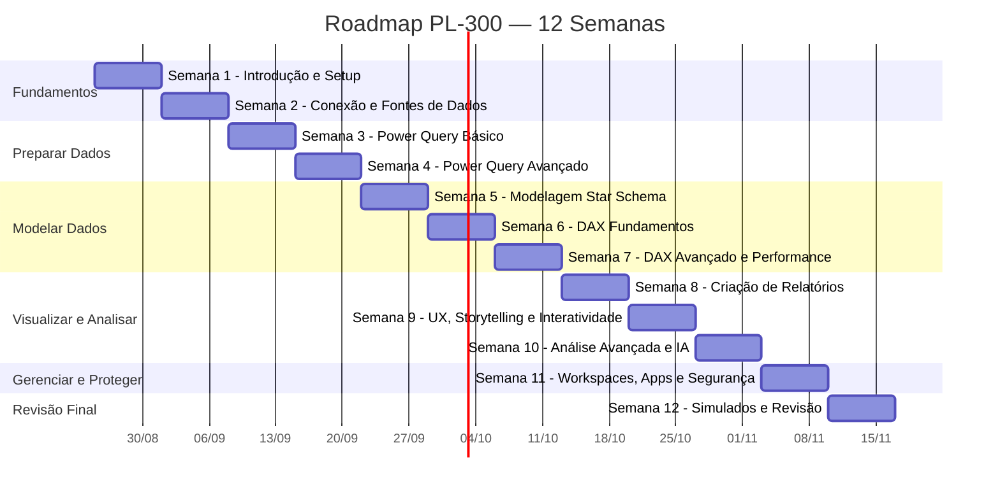
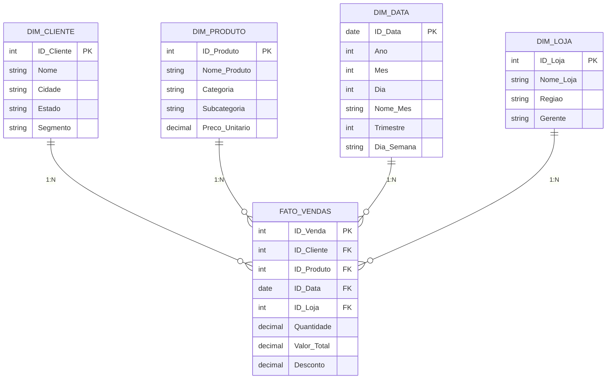

# 📊 Plano de Estudos — Certificação Microsoft PL-300
## Power BI Data Analyst Associate

---

> [!NOTE]
> **Última atualização do exame:** 20/04/2026  
> **Duração do exame:** 100 minutos  
> **Nível:** Intermediário  
> **Idioma disponível:** Português (Brasil)  
> **Renovação:** A cada 12 meses (gratuita, via avaliação online)  
> **Nota mínima para aprovação:** 700/1000  
> **Fonte oficial:** [Microsoft Learn — PL-300](https://learn.microsoft.com/pt-br/credentials/certifications/data-analyst-associate/)

---

## 📋 Índice

1. [Visão Geral do Exame](#1--visão-geral-do-exame)
2. [Roadmap de Estudos (12 Semanas)](#2--roadmap-de-estudos-12-semanas)
3. [Domínio 1 — Preparar os Dados (25–30%)](#3--domínio-1--preparar-os-dados-2530)
4. [Domínio 2 — Modelar os Dados (25–30%)](#4--domínio-2--modelar-os-dados-2530)
5. [Domínio 3 — Visualizar e Analisar os Dados (25–30%)](#5--domínio-3--visualizar-e-analisar-os-dados-2530)
6. [Domínio 4 — Gerenciar e Proteger o Power BI (15–20%)](#6--domínio-4--gerenciar-e-proteger-o-power-bi-1520)
7. [Projetos Práticos](#7--projetos-práticos)
8. [Fórmulas DAX Essenciais](#8--fórmulas-dax-essenciais)
9. [Transformações Power Query Essenciais](#9--transformações-power-query-essenciais)
10. [Checklist de Preparação Final](#10--checklist-de-preparação-final)
11. [Recursos e Links Úteis](#11--recursos-e-links-úteis)
12. [Dicas para o Dia do Exame](#12--dicas-para-o-dia-do-exame)

---

## 1. 📌 Visão Geral do Exame

O exame PL-300 valida a capacidade de um profissional em usar o **Microsoft Power BI** para transformar dados em insights acionáveis. Você deve dominar:

| Domínio | Peso no Exame |
|---|---|
| **Preparar os Dados** | 25–30% |
| **Modelar os Dados** | 25–30% |
| **Visualizar e Analisar os Dados** | 25–30% |
| **Gerenciar e Proteger o Power BI** | 15–20% |

### O que é esperado do candidato

- Entregar valor comercial significativo por meio de visualizações de dados claras
- Capacitar outras pessoas a realizar análise de autoatendimento (self-service)
- Ser proficiente em **Power Query** (linguagem M) e **DAX** (Data Analysis Expressions)
- Colaborar com stakeholders de negócio, engenheiros de dados e engenheiros de análise

### Formato do Exame

- **Perguntas:** ~40-60 questões (múltipla escolha, arrastar e soltar, estudos de caso, componentes interativos/labs)
- **Duração:** 100 minutos
- **Nota para aprovação:** 700/1000
- **Agendamento:** Via Pearson VUE (presencial ou online com proctoring)

---

## 2. 🗺️ Roadmap de Estudos (12 Semanas)

### Pré-requisitos

Antes de iniciar, certifique-se de ter:

- [x] **Power BI Desktop** instalado (gratuito)
- [x] Conta gratuita no **Power BI Service** (app.powerbi.com)
- [ ] Conta no **Microsoft Learn**
- [ ] Conhecimento básico de Excel/planilhas
- [ ] Noções de bancos de dados relacionais (tabelas, colunas, chaves)

---

### 📅 Cronograma Semana a Semana



---

### 📘 Semana 1 — Introdução e Setup

**Objetivo:** Entender o ecossistema Power BI e configurar o ambiente.

- [ ] Instalar Power BI Desktop
- [ ] Criar conta no Power BI Service
- [ ] Entender a arquitetura: Desktop → Service → Mobile → Report Server
- [ ] Conhecer os componentes: Semantic Model (Dataset), Report, Dashboard, App, Workspace
- [ ] Explorar a interface do Power BI Desktop (painéis: Relatório, Dados, Modelo)

**Estudo:** [Microsoft Learn — Introdução ao Power BI](https://learn.microsoft.com/pt-br/training/modules/get-started-with-power-bi/)

---

### 📘 Semana 2 — Conexão e Fontes de Dados

**Objetivo:** Conectar a diversas fontes e entender modos de armazenamento.

- [ ] Conectar a fontes: Excel, CSV, SQL Server, Web, SharePoint, pasta de arquivos
- [ ] Diferenças entre **Import**, **DirectQuery** e **DirectLake**
- [ ] Configurar credenciais e níveis de privacidade (Organizational, Private, Public)
- [ ] Criar e usar **parâmetros** no Power Query
- [ ] Conectar-se a um **Semantic Model compartilhado** (live connection)

**Conceitos-chave para o exame:**

| Modo | Dados onde? | Atualização | Performance |
|---|---|---|---|
| **Import** | Na memória do Power BI | Agendada | Mais rápida |
| **DirectQuery** | Na fonte original | Em tempo real | Mais lenta |
| **DirectLake** | OneLake (Fabric) | Automática | Rápida |

> [!IMPORTANT]
> O exame testa frequentemente quando usar Import vs DirectQuery. Use **Import** como padrão; **DirectQuery** quando os dados são muito grandes ou precisam estar em tempo real; **DirectLake** com Microsoft Fabric.

---

### 📘 Semana 3 — Power Query Básico (Preparar Dados)

**Objetivo:** Limpar e transformar dados usando o Editor do Power Query.

- [ ] Avaliar dados com **Perfil de Dados** (distribuição, qualidade, estatísticas de coluna)
- [ ] Alterar tipos de dados das colunas
- [ ] Remover linhas em branco, duplicatas e erros
- [ ] Tratar valores nulos (`null`)
- [ ] Substituir valores
- [ ] Renomear colunas e tabelas
- [ ] Dividir e mesclar colunas
- [ ] Adicionar colunas personalizadas (custom columns)
- [ ] Adicionar colunas condicionais
- [ ] Adicionar colunas de índice

**Ativação no Power BI Desktop:**
> Aba "Exibição" → marcar: ✅ Qualidade da Coluna, ✅ Distribuição da Coluna, ✅ Perfil da Coluna  
> Mudar "Criação de perfil da coluna com base em" para **"conjunto de dados inteiro"** (padrão é 1000 linhas)

---

### 📘 Semana 4 — Power Query Avançado

**Objetivo:** Dominar transformações complexas para modelagem.

- [ ] **Agrupar por** (Group By) — simples e avançado
- [ ] **Pivotar** e **Despivotar** colunas (Pivot/Unpivot)
- [ ] **Transpor** dados
- [ ] **Mesclar consultas** (Merge) — tipos de JOIN: Inner, Left Outer, Right Outer, Full Outer, Anti joins
- [ ] **Acrescentar consultas** (Append) — empilhar tabelas
- [ ] **Consulta de referência** vs **Consulta duplicada**
  - *Referência:* cria nova consulta que aponta para a original (dependente)
  - *Duplicada:* cria cópia independente
- [ ] Converter dados semi-estruturados (JSON, XML) em tabelas
- [ ] Criar **tabelas Fato** e **tabelas Dimensão** no Power Query
- [ ] Configurar carregamento de consultas (habilitar/desabilitar carga)
- [ ] Identificar e criar chaves apropriadas para relacionamentos

> [!TIP]
> **Merge** = combinar colunas de tabelas diferentes (como JOIN no SQL).  
> **Append** = empilhar linhas de tabelas semelhantes (como UNION no SQL).

---

### 📘 Semana 5 — Modelagem de Dados (Star Schema)

**Objetivo:** Construir modelos de dados eficientes usando Star Schema.

- [ ] Entender **Star Schema** (Esquema Estrela): Tabela Fato + Tabelas Dimensão
- [ ] Configurar propriedades de tabelas e colunas (formato, categoria de dados, ordenação)
- [ ] Criar e gerenciar **relacionamentos**:
  - Cardinalidade: 1:N (mais comum), 1:1, N:N
  - Direção do filtro cruzado: Single (padrão), Both (bidirecional)
- [ ] Implementar **dimensões de representação de papel** (role-playing dimensions)
  - Ex: Tabela de Datas usada como "Data do Pedido" e "Data de Entrega"
  - Solução: criar cópias inativas e usar `USERELATIONSHIP()` no DAX
- [ ] Criar uma **tabela de Datas comum** (Date Table)
  - Marcar como "Tabela de Datas" para habilitar Time Intelligence
- [ ] Entender quando usar **colunas calculadas** vs **tabelas calculadas**
  - Colunas calculadas: avaliadas em row context, armazenadas no modelo
  - Tabelas calculadas: criadas via DAX, úteis para tabelas de datas

**Modelo Star Schema — Diagrama:**



---

### 📘 Semana 6 — DAX Fundamentos

**Objetivo:** Dominar as funções DAX essenciais para o exame.

- [ ] Entender **contexto de filtro** (filter context) e **contexto de linha** (row context)
- [ ] Criar medidas de **agregação simples**: `SUM`, `AVERAGE`, `COUNT`, `COUNTROWS`, `DISTINCTCOUNT`, `MIN`, `MAX`
- [ ] Dominar a função `CALCULATE` — a mais importante do DAX
  - Modifica o contexto de filtro
  - Sintaxe: `CALCULATE(<expressão>, <filtro1>, <filtro2>, ...)`
- [ ] Funções de iteração: `SUMX`, `AVERAGEX`, `COUNTX`, `MAXX`, `MINX`
- [ ] Funções lógicas: `IF`, `SWITCH`, `AND`, `OR`, `NOT`
- [ ] Funções de texto: `CONCATENATE`, `FORMAT`, `LEFT`, `RIGHT`, `LEN`, `UPPER`
- [ ] Funções de tabela: `FILTER`, `ALL`, `ALLEXCEPT`, `VALUES`, `DISTINCT`
- [ ] Criar medidas com **Quick Measures** (medidas rápidas)
- [ ] Criar **colunas calculadas** vs **medidas** — quando usar cada uma

> [!IMPORTANT]
> **Regra de Ouro:** Prefira **medidas** sempre que possível. Colunas calculadas consomem memória e são avaliadas na atualização; medidas são avaliadas em tempo de consulta e são dinâmicas.

---

### 📘 Semana 7 — DAX Avançado e Performance

**Objetivo:** Time Intelligence, medidas semi-aditivas e otimização.

- [ ] **Time Intelligence** (requer tabela de datas marcada):
  - `TOTALYTD`, `TOTALQTD`, `TOTALMTD`
  - `SAMEPERIODLASTYEAR`, `DATEADD`, `DATESYTD`
  - `PREVIOUSMONTH`, `PREVIOUSQUARTER`, `PREVIOUSYEAR`
  - `PARALLELPERIOD`
- [ ] **Medidas semi-aditivas** (valores que não somam ao longo do tempo):
  - `LASTDATE`, `FIRSTDATE`, `LASTNONBLANK`, `FIRSTNONBLANK`
  - Ex: saldo bancário, estoque, headcount
- [ ] Funções estatísticas: `MEDIAN`, `PERCENTILE.INC`, `STDEV.P`, `VAR.P`, `RANKX`
- [ ] **Calculation Groups** (Grupos de Cálculo):
  - Permitem aplicar diferentes cálculos (YTD, MoM, YoY) sem duplicar medidas
- [ ] **Visual Calculations** (Cálculos Visuais) com DAX:
  - `RUNNINGSUM`, `MOVINGAVERAGE`, etc. aplicados diretamente em visuais
- [ ] **Otimização de performance:**
  - Remover colunas e linhas desnecessárias
  - Usar **Performance Analyzer** para identificar gargalos
  - Usar **DAX Query View** para testar e otimizar medidas
  - Reduzir granularidade quando possível
  - Evitar `DISTINCTCOUNT` em colunas com alta cardinalidade
  - Evitar filtro bidirecional (Both) desnecessário

---

### 📘 Semana 8 — Criação de Relatórios

**Objetivo:** Construir relatórios profissionais e escolher visuais adequados.

- [ ] Escolher o visual correto para cada cenário:

| Objetivo | Visual Recomendado |
|---|---|
| Comparar categorias | Gráfico de barras/colunas |
| Tendência ao longo do tempo | Gráfico de linhas |
| Proporção/parte de um todo | Gráfico de pizza/rosca/treemap |
| Correlação entre variáveis | Gráfico de dispersão |
| Distribuição | Histograma |
| Geo-localização | Mapa, Mapa preenchido |
| KPIs de alto nível | Cartão, Cartão de múltiplas linhas, KPI |
| Tabela detalhada | Tabela, Matriz |
| Fluxo/progresso | Gráfico de cascata, funil |
| Narrativa com IA | Visual Narrativa (Copilot) |

- [ ] Formatar e configurar visuais (títulos, rótulos, eixos, legendas, cores)
- [ ] Aplicar e personalizar **temas** (arquivo JSON de tema)
- [ ] Aplicar **formatação condicional** (cores de fundo, barras de dados, ícones, regras)
- [ ] Aplicar **slicers** (segmentações) e **filtros** (nível visual, página e relatório)
- [ ] Criar **visual narrativo com Copilot**
- [ ] Usar **Copilot** para criar/sugerir conteúdo de novas páginas de relatório
- [ ] Configurar a **página do relatório** (tamanho, plano de fundo, papel de parede)
- [ ] Entender quando usar **relatório paginado** vs relatório interativo:
  - Paginado: ideal para impressão, formatos fixos, notas fiscais, listas longas
  - Interativo: dashboards analíticos, exploração de dados

---

### 📘 Semana 9 — UX, Storytelling e Interatividade

**Objetivo:** Tornar relatórios usáveis, acessíveis e com boa narrativa.

- [ ] Configurar **bookmarks** (marcadores) para navegação e estados salvos
- [ ] Criar **tooltips personalizados** (dica de ferramenta com página de relatório)
- [ ] Editar **interações entre visuais** (filtrar, realçar, nenhum)
- [ ] Configurar **navegação** para relatório (botões, ações, navegação por página)
- [ ] Aplicar **ordenação** em visuais
- [ ] Configurar **sync slicers** (segmentações sincronizadas entre páginas)
- [ ] Usar o **painel de Seleção** para agrupar e camadear visuais
- [ ] Configurar **drillthrough** (detalhamento):
  - Páginas de drillthrough com filtros
  - Botões de drillthrough
  - Cross-report drillthrough
- [ ] Configurar **exportação** de dados
- [ ] Projetar relatórios para **dispositivos móveis** (layout mobile)
- [ ] Habilitar **personalização de visuais** para usuários finais
- [ ] Projetar para **acessibilidade** (alt text, ordem de tabulação, contraste, marcadores de dados)
- [ ] Configurar **atualização automática de página** (para DirectQuery)

---

### 📘 Semana 10 — Análise Avançada e IA

**Objetivo:** Usar recursos de análise e inteligência artificial do Power BI.

- [ ] Usar o recurso **"Analisar"** (Analyze):
  - Analyze → Explain the increase/decrease
  - Analyze → Find where the distribution is different
- [ ] Usar **agrupamento** (grouping), **compartimentalização** (binning) e **clustering**
- [ ] Usar **visuais de IA**:
  - Árvore de decomposição (Decomposition Tree)
  - Principais influenciadores (Key Influencers)
  - Perguntas e Respostas (Q&A)
  - Narrativa inteligente (Smart Narrative)
- [ ] Usar **linhas de referência**, **barras de erro** e **previsão** (forecasting)
- [ ] Detectar **outliers e anomalias** (Anomaly Detection)
- [ ] Usar **Copilot para resumir o Semantic Model**

---

### 📘 Semana 11 — Gerenciar e Proteger o Power BI

**Objetivo:** Administrar workspaces, apps, segurança e governança.

- [ ] Criar e configurar **workspaces**
- [ ] Configurar e atualizar **apps** (aplicativos Power BI)
- [ ] **Publicar**, importar e atualizar itens em um workspace
- [ ] Criar **dashboards** (fixar visuais de relatórios, Q&A, etc.)
- [ ] Escolher método de **distribuição**: App, Compartilhamento direto, Publicar na Web, Incorporar
- [ ] Configurar **assinaturas** e **alertas de dados**
- [ ] **Promover** ou **certificar** conteúdo Power BI
- [ ] Identificar quando um **gateway** é necessário:
  - Gateway necessário para fontes on-premises (SQL Server local, arquivos de rede)
  - Não necessário para fontes cloud (SharePoint Online, Azure SQL, etc.)
- [ ] Configurar **atualização agendada** do Semantic Model
- [ ] **Funções do Workspace:**

| Função | Permissões |
|---|---|
| **Admin** | Controle total (inclusive excluir workspace) |
| **Membro** | Publicar, editar, compartilhar conteúdo |
| **Colaborador** | Publicar e editar conteúdo |
| **Visualizador** | Apenas visualizar conteúdo |

- [ ] Configurar **acesso em nível de item**
- [ ] Configurar **acesso a Semantic Models** (Build permission)
- [ ] Implementar **Row-Level Security (RLS)**:
  - Criar funções com expressões DAX: ex. `[Região] = "Sul"`
  - Usar `USERPRINCIPALNAME()` para RLS dinâmico
  - Configurar membros das funções RLS
  - Testar RLS com "Exibir como função"
- [ ] Aplicar **rótulos de sensibilidade** (Sensitivity Labels) via Microsoft Purview

---

### 📘 Semana 12 — Revisão Final e Simulados

**Objetivo:** Consolidar conhecimentos e praticar com simulados.

- [ ] Fazer a **Avaliação Prática oficial** no Microsoft Learn:
  - [Avaliação Prática PL-300](https://learn.microsoft.com/pt-br/credentials/certifications/data-analyst-associate/practice/assessment?assessment-type=practice&assessmentId=48)
- [ ] Usar a **Área Restrita do Exame** (Exam Sandbox):
  - [Iniciar Sandbox](https://go.microsoft.com/fwlink/?linkid=2226877)
- [ ] Assistir os **vídeos preparatórios**:
  - [Exam Readiness Zone — PL-300](https://learn.microsoft.com/en-us/shows/exam-readiness-zone/preparing-for-pl-300-prepare-the-data)
- [ ] Revisar pontos fracos identificados nos simulados
- [ ] Refazer projetos práticos focando nos pontos fracos
- [ ] Revisar o [Guia de Estudos Oficial PL-300](https://aka.ms/pl300-StudyGuide)

---

## 3. 📦 Domínio 1 — Preparar os Dados (25–30%)

### 3.1 Obter ou Conectar-se a Dados

| Habilidade | Detalhes |
|---|---|
| Identificar e conectar a fontes de dados | Excel, CSV, SQL, Web, SharePoint, Dataverse, OData, Semantic Model compartilhado |
| Alterar configurações de fonte de dados | Credenciais, níveis de privacidade (Organization, Private, Public) |
| Escolher entre DirectLake, DirectQuery e Import | Veja tabela da Semana 2 |
| Criar e modificar parâmetros | Parâmetros no Power Query para troca dinâmica de fontes, filtros |

### 3.2 Criar Perfil e Limpar os Dados

| Habilidade | Detalhes |
|---|---|
| Avaliar dados | Usar estatísticas de coluna, distribuição de valores, qualidade dos dados |
| Resolver inconsistências | Tratar nulos, valores inesperados, problemas de qualidade |
| Resolver erros de importação | Tratar erros de tipo, encoding, delimitadores |

### 3.3 Transformar e Carregar os Dados

| Habilidade | Detalhes |
|---|---|
| Selecionar tipos de dados | Texto, número inteiro/decimal, data/hora, booleano |
| Criar e transformar colunas | Colunas personalizadas, condicionais, extração de texto |
| Agrupar e agregar linhas | Group By com SUM, COUNT, AVG, MIN, MAX |
| Pivotar/Despivotar/Transpor | Reestruturar tabelas |
| Converter dados semi-estruturados | JSON/XML → tabela |
| Criar tabelas Fato e Dimensão | Separar dados transacionais de descritivos |
| Referência vs Duplicata | Referência mantém dependência; duplicata é independente |
| Merge e Append | JOIN vs UNION |
| Criar chaves para relacionamentos | Identificar/criar chaves primárias e estrangeiras |
| Configurar carregamento | Habilitar/desabilitar carga, habilitar/desabilitar etapas de preparação |

---

## 4. 🏗️ Domínio 2 — Modelar os Dados (25–30%)

### 4.1 Design e Implementação do Modelo

| Habilidade | Detalhes |
|---|---|
| Configurar propriedades de tabela/coluna | Formato, categoria de dados, ordem de classificação, visibilidade |
| Dimensões role-playing | Mesma tabela (ex: Datas) usada em múltiplos relacionamentos |
| Cardinalidade e filtro cruzado | 1:N, 1:1, N:N; Single vs Both |
| Tabela de datas | Criar via DAX (`CALENDARAUTO()`, `CALENDAR()`) ou Power Query |
| Colunas/tabelas calculadas | Casos de uso e impacto na performance |

### 4.2 Cálculos com DAX

| Habilidade | Detalhes |
|---|---|
| Medidas de agregação | SUM, AVERAGE, COUNT, MIN, MAX, DISTINCTCOUNT |
| CALCULATE | Alterar contexto de filtro |
| Time Intelligence | YTD, QTD, MTD, SAMEPERIODLASTYEAR, DATEADD |
| Funções estatísticas | MEDIAN, PERCENTILE, STDEV, RANKX |
| Medidas semi-aditivas | LASTDATE, LASTNONBLANK (estoque, saldo) |
| Quick Measures | Atalhos para cálculos comuns |
| Tabelas/colunas calculadas | ADDCOLUMNS, SUMMARIZE, CALENDAR, CALENDARAUTO |
| Calculation Groups | Aplicar variações de cálculos a múltiplas medidas |

### 4.3 Otimizar Performance

| Habilidade | Detalhes |
|---|---|
| Remover dados desnecessários | Colunas e linhas que não serão usadas |
| Performance Analyzer | Identificar visuais e DAX lentos |
| DAX Query View | Testar e otimizar consultas DAX |
| Reduzir granularidade | Agregar dados no nível necessário |

---

## 5. 📈 Domínio 3 — Visualizar e Analisar os Dados (25–30%)

### 5.1 Criar Relatórios

- Selecionar visuais apropriados para cada cenário de análise
- Formatar e configurar visuais (cores, eixos, rótulos, legendas)
- Narrativa visual com Copilot
- Temas personalizados (JSON)
- Formatação condicional (cores, ícones, barras)
- Segmentadores (slicers) e filtros (visual, página, relatório)
- Copilot para criar/sugerir páginas de relatório
- Configurar página (tamanho, fundo)
- Quando usar relatório paginado vs interativo
- Visual Calculations com DAX

### 5.2 Aprimorar Relatórios para Usabilidade e Storytelling

- Bookmarks, tooltips personalizados, interações entre visuais
- Navegação com botões, drillthrough, sync slicers
- Painel de seleção (agrupamento/camadas)
- Configurar exportação, design mobile, personalização de visuais
- Acessibilidade (alt text, tabulação, contraste)
- Atualização automática de página

### 5.3 Identificar Padrões e Tendências

- Recurso "Analisar" do Power BI
- Agrupamento, compartimentalização, clustering
- Visuais de IA (Decomposition Tree, Key Influencers, Q&A, Smart Narrative)
- Linhas de referência, barras de erro, forecasting
- Detecção de outliers e anomalias
- Copilot para resumo do Semantic Model

---

## 6. 🔒 Domínio 4 — Gerenciar e Proteger o Power BI (15–20%)

### 6.1 Criar e Gerenciar Workspaces e Ativos

- Criar/configurar workspaces
- Apps (configurar, atualizar, publicar)
- Dashboards (fixar visuais, Q&A tiles)
- Métodos de distribuição
- Assinaturas e alertas
- Promover/certificar conteúdo
- Gateways (quando necessário)
- Atualização agendada

### 6.2 Proteger e Governar Itens do Power BI

- Funções do Workspace (Admin, Membro, Colaborador, Visualizador)
- Acesso em nível de item
- Acesso a Semantic Models (permissão Build)
- **Row-Level Security (RLS):** criar funções, atribuir membros, testar
- Rótulos de sensibilidade (Microsoft Purview)

---

## 7. 🛠️ Projetos Práticos

### Projeto 1 — Dashboard de Vendas de E-Commerce

> **Domínios cobertos:** Preparar Dados, Modelar Dados, Visualizar e Analisar

**Cenário:** Você é analista de dados de um e-commerce e recebeu planilhas Excel com dados de vendas, clientes, produtos e lojas. Seu objetivo é criar um dashboard interativo para a diretoria.

**Fontes de dados (criar em Excel/CSV):**

**📄 Tabela: Vendas (Fato)**
```
ID_Venda | Data_Venda  | ID_Cliente | ID_Produto | ID_Loja | Quantidade | Valor_Unitario | Desconto
1001     | 2024-01-15  | C001       | P010       | L01     | 2          | 89.90          | 0.10
1002     | 2024-01-16  | C002       | P025       | L02     | 1          | 299.00         | 0.00
1003     | 2024-01-16  | C001       | P003       | L01     | 5          | 15.50          | 0.05
...      | (gere ~500 linhas com dados variados)
```

**📄 Tabela: Clientes (Dimensão)**
```
ID_Cliente | Nome_Cliente     | Cidade        | Estado | Segmento
C001       | Maria Silva      | São Paulo     | SP     | Pessoa Física
C002       | Tech Solutions   | Rio de Janeiro| RJ     | Pessoa Jurídica
...        | (gere ~50 clientes)
```

**📄 Tabela: Produtos (Dimensão)**
```
ID_Produto | Nome_Produto      | Categoria    | Subcategoria  | Preco_Custo
P010       | Fone Bluetooth    | Eletrônicos  | Áudio         | 35.00
P025       | Notebook Pro      | Eletrônicos  | Computadores  | 180.00
P003       | Caderno A4        | Papelaria    | Cadernos      | 5.00
...        | (gere ~30 produtos)
```

**📄 Tabela: Lojas (Dimensão)**
```
ID_Loja | Nome_Loja      | Regiao   | Gerente
L01     | Loja Centro SP | Sudeste  | João Almeida
L02     | Loja Copacabana| Sudeste  | Ana Pereira
L03     | Loja Recife    | Nordeste | Carlos Lima
...     | (gere ~8 lojas)
```

**Passo a passo:**

1. **Preparar Dados (Power Query):**
   - Importar os 4 arquivos Excel/CSV
   - Verificar perfil de dados (qualidade, distribuição, estatísticas)
   - Corrigir tipos de dados (Data, Inteiro, Decimal, Texto)
   - Tratar valores nulos e inconsistências
   - Criar coluna calculada `Valor_Total = Quantidade * Valor_Unitario * (1 - Desconto)`
   - Criar coluna `Lucro = Valor_Total - (Quantidade * Preco_Custo)` usando Merge com Produtos

2. **Modelar Dados:**
   - Montar Star Schema: Vendas (Fato) → Clientes, Produtos, Lojas, Datas (Dimensões)
   - Criar tabela de Datas com DAX:
   ```dax
   Dim_Data = 
   ADDCOLUMNS(
       CALENDAR(DATE(2024,1,1), DATE(2024,12,31)),
       "Ano", YEAR([Date]),
       "Mês", MONTH([Date]),
       "Nome_Mês", FORMAT([Date], "MMMM"),
       "Trimestre", "T" & FORMAT([Date], "Q"),
       "Dia_Semana", FORMAT([Date], "dddd"),
       "Num_Dia_Semana", WEEKDAY([Date], 2)
   )
   ```
   - Marcar como Tabela de Datas
   - Criar relacionamentos 1:N
   - Ocultar colunas de chave estrangeira na tabela Fato

3. **Criar Medidas DAX:**
   ```dax
   Total Vendas = SUM(Vendas[Valor_Total])
   
   Total Lucro = SUM(Vendas[Lucro])
   
   Margem de Lucro = DIVIDE([Total Lucro], [Total Vendas], 0)
   
   Qtd Vendas = COUNTROWS(Vendas)
   
   Ticket Médio = DIVIDE([Total Vendas], [Qtd Vendas], 0)
   
   Vendas YTD = TOTALYTD([Total Vendas], Dim_Data[Date])
   
   Vendas Mês Anterior = CALCULATE([Total Vendas], PREVIOUSMONTH(Dim_Data[Date]))
   
   Variação MoM = 
   VAR _Atual = [Total Vendas]
   VAR _Anterior = [Vendas Mês Anterior]
   RETURN DIVIDE(_Atual - _Anterior, _Anterior, 0)
   
   Vendas Ano Anterior = CALCULATE([Total Vendas], SAMEPERIODLASTYEAR(Dim_Data[Date]))
   ```

4. **Visualizar:**
   - Página 1: **Visão Geral** — Cartões (KPIs), gráfico de barras por categoria, gráfico de linhas mensal
   - Página 2: **Análise Regional** — Mapa por estado, tabela por loja, segmentador de região
   - Página 3: **Detalhamento** — Página de drillthrough por produto com matriz detalhada
   - Aplicar tema personalizado, formatação condicional no Lucro (verde/vermelho)
   - Criar bookmarks para alternar entre visões
   - Configurar tooltips personalizados
   - Criar layout mobile

---

### Projeto 2 — Análise de RH (Recursos Humanos)

> **Domínios cobertos:** Modelar Dados, DAX Avançado (medidas semi-aditivas), RLS

**Cenário:** Analisar dados de headcount, turnover e salários de uma empresa.

**Fontes de dados:**

**📄 Tabela: Funcionarios**
```
ID_Func | Nome            | Departamento | Cargo          | Data_Admissao | Data_Demissao | Salario  | Cidade
F001    | Ana Costa       | TI           | Desenvolvedora | 2022-03-15    | null          | 8500.00  | São Paulo
F002    | Pedro Santos    | RH           | Analista RH    | 2021-06-01    | 2024-08-30    | 5200.00  | São Paulo
F003    | Julia Martins   | Financeiro   | Controller     | 2020-01-10    | null          | 12000.00 | Curitiba
...     | (gere ~200 funcionários com mix de ativos e demitidos)
```

**Exercícios-chave:**

- **Medida semi-aditiva — Headcount:**
  ```dax
  Headcount = 
  CALCULATE(
      COUNTROWS(Funcionarios),
      FILTER(
          Funcionarios,
          Funcionarios[Data_Admissao] <= MAX(Dim_Data[Date])
          && (ISBLANK(Funcionarios[Data_Demissao]) 
              || Funcionarios[Data_Demissao] > MAX(Dim_Data[Date]))
      )
  )
  ```

- **Turnover Rate:**
  ```dax
  Taxa Turnover = 
  VAR _Demitidos = CALCULATE(
      COUNTROWS(Funcionarios),
      NOT(ISBLANK(Funcionarios[Data_Demissao])),
      FILTER(
          Dim_Data,
          Dim_Data[Date] >= MIN(Dim_Data[Date]) 
          && Dim_Data[Date] <= MAX(Dim_Data[Date])
      )
  )
  VAR _MediaHC = AVERAGEX(
      VALUES(Dim_Data[Mês]),
      [Headcount]
  )
  RETURN DIVIDE(_Demitidos, _MediaHC, 0)
  ```

- **Row-Level Security (RLS):**
  - Criar função "Gerente Departamento" com filtro DAX:
    ```dax
    [Departamento] = LOOKUPVALUE(
        Gerentes[Departamento],
        Gerentes[Email],
        USERPRINCIPALNAME()
    )
    ```
  - Testar com "Exibir como função"

---

### Projeto 3 — Relatório Financeiro com Dados de Banco de Dados

> **Domínios cobertos:** Conexão a banco de dados, DirectQuery, Relatório Paginado

**Cenário:** Conectar a um banco SQL Server (ou SQLite/PostgreSQL) para análise financeira.

**Setup do banco de dados:**

```sql
-- Script para criar tabelas de exemplo (SQL Server / SQLite)

CREATE TABLE Plano_Contas (
    ID_Conta INT PRIMARY KEY,
    Descricao VARCHAR(100),
    Tipo VARCHAR(20), -- 'Receita', 'Despesa', 'Ativo', 'Passivo'
    Grupo VARCHAR(50)
);

CREATE TABLE Lancamentos (
    ID_Lanc INT PRIMARY KEY,
    Data_Lanc DATE,
    ID_Conta INT REFERENCES Plano_Contas(ID_Conta),
    Valor DECIMAL(15,2),
    Tipo_Mov CHAR(1), -- 'D' Débito, 'C' Crédito
    Centro_Custo VARCHAR(50),
    Descricao VARCHAR(200)
);

-- Inserir dados de exemplo
INSERT INTO Plano_Contas VALUES (1, 'Receita de Vendas', 'Receita', 'Receitas Operacionais');
INSERT INTO Plano_Contas VALUES (2, 'Custo de Mercadorias', 'Despesa', 'Custos');
INSERT INTO Plano_Contas VALUES (3, 'Salários', 'Despesa', 'Despesas com Pessoal');
INSERT INTO Plano_Contas VALUES (4, 'Aluguel', 'Despesa', 'Despesas Administrativas');
INSERT INTO Plano_Contas VALUES (5, 'Caixa', 'Ativo', 'Ativo Circulante');
-- ... adicionar mais contas e lançamentos

INSERT INTO Lancamentos VALUES (1, '2024-01-05', 1, 50000.00, 'C', 'Vendas', 'Receita de vendas Jan');
INSERT INTO Lancamentos VALUES (2, '2024-01-10', 2, 20000.00, 'D', 'Produção', 'CMV Janeiro');
INSERT INTO Lancamentos VALUES (3, '2024-01-31', 3, 35000.00, 'D', 'RH', 'Folha Jan');
-- ... gerar lançamentos para 12 meses
```

**Exercícios-chave:**

1. Conectar via **DirectQuery** ao SQL Server
2. Usar **parâmetros** do Power Query para alternar entre servidores (dev/prod)
3. Criar medida de **saldo acumulado** (semi-aditiva):
   ```dax
   Saldo = 
   CALCULATE(
       SUMX(Lancamentos, 
           IF(Lancamentos[Tipo_Mov] = "C", Lancamentos[Valor], -Lancamentos[Valor])
       ),
       FILTER(
           ALL(Dim_Data),
           Dim_Data[Date] <= MAX(Dim_Data[Date])
       )
   )
   ```
4. Criar **relatório paginado** para DRE (Demonstração do Resultado do Exercício)
5. Identificar quando o **Gateway** é necessário (fonte on-premises)

---

### Projeto 4 — Análise de Dados Web (JSON/API)

> **Domínios cobertos:** Dados semi-estruturados, Power Query avançado

**Cenário:** Consumir uma API pública que retorna JSON e transformar em tabela.

**Passo a passo:**

1. Conectar a uma API pública via **Web connector**
   - Exemplo: `https://jsonplaceholder.typicode.com/posts` (API gratuita de teste)
   - Ou usar a API do IBGE: `https://servicodados.ibge.gov.br/api/v1/localidades/estados`
2. No Power Query:
   - Converter lista JSON para tabela (`To Table`)
   - Expandir colunas de registro (Record)
   - Expandir colunas de lista (List)
   - Tratar aninhamentos de JSON
3. Combinar com dados locais via **Merge**
4. Pivotar/Despivotar dados conforme necessário

---

### Projeto 5 — Workspace, App e Governança

> **Domínios cobertos:** Gerenciar e Proteger Power BI

**Cenário:** Simular a implantação completa de um projeto no Power BI Service.

**Exercícios:**

1. Criar **Workspace** "Vendas - Produção"
2. **Publicar** o relatório do Projeto 1 no workspace
3. Configurar **atualização agendada** (diária, 8h)
4. Criar um **Dashboard** fixando visuais do relatório
5. Configurar **alerta de dados** no cartão de Vendas Totais
6. Criar uma **App** com audiência pública para a diretoria
7. **Promover** o Semantic Model como "Promovido"
8. Configurar **RLS** com duas funções (Gerente Norte, Gerente Sul)
9. Atribuir membros às funções RLS
10. Configurar **assinatura** de e-mail para página do relatório
11. Aplicar **rótulo de sensibilidade** "Confidencial"

---

## 8. 📐 Fórmulas DAX Essenciais

### Agregação Básica
```dax
Total Vendas = SUM(Vendas[Valor_Total])
Média Vendas = AVERAGE(Vendas[Valor_Total])
Contagem = COUNTROWS(Vendas)
Clientes Únicos = DISTINCTCOUNT(Vendas[ID_Cliente])
Maior Venda = MAX(Vendas[Valor_Total])
Menor Venda = MIN(Vendas[Valor_Total])
```

### CALCULATE e Modificadores de Filtro
```dax
-- CALCULATE básico
Vendas SP = CALCULATE([Total Vendas], Clientes[Estado] = "SP")

-- CALCULATE com ALL (remove filtros)
% do Total = DIVIDE([Total Vendas], CALCULATE([Total Vendas], ALL(Produtos)))

-- CALCULATE com ALLEXCEPT (remove tudo exceto)
% do Total Categoria = 
DIVIDE(
    [Total Vendas], 
    CALCULATE([Total Vendas], ALLEXCEPT(Produtos, Produtos[Categoria]))
)

-- CALCULATE com FILTER
Vendas Alto Valor = 
CALCULATE(
    [Total Vendas],
    FILTER(Vendas, Vendas[Valor_Total] > 1000)
)

-- CALCULATE com KEEPFILTERS
Vendas Eletrônicos = 
CALCULATE(
    [Total Vendas],
    KEEPFILTERS(Produtos[Categoria] = "Eletrônicos")
)
```

### Time Intelligence
```dax
-- Acumulado no ano
Vendas YTD = TOTALYTD([Total Vendas], Dim_Data[Date])

-- Mesmo período do ano anterior
Vendas Ano Anterior = CALCULATE([Total Vendas], SAMEPERIODLASTYEAR(Dim_Data[Date]))

-- Variação ano a ano
Variação YoY = 
VAR _Atual = [Total Vendas]
VAR _Anterior = [Vendas Ano Anterior]
RETURN DIVIDE(_Atual - _Anterior, _Anterior, 0)

-- Mês anterior
Vendas Mês Anterior = CALCULATE([Total Vendas], PREVIOUSMONTH(Dim_Data[Date]))

-- Média móvel 3 meses
Média Móvel 3M = 
AVERAGEX(
    DATESINPERIOD(Dim_Data[Date], MAX(Dim_Data[Date]), -3, MONTH),
    [Total Vendas]
)

-- Acumulado no trimestre
Vendas QTD = TOTALQTD([Total Vendas], Dim_Data[Date])
```

### Medidas Semi-Aditivas
```dax
-- Saldo no último dia do período
Saldo Final = 
CALCULATE(
    SUM(Conta[Saldo]),
    LASTDATE(Dim_Data[Date])
)

-- Último valor não vazio
Último Estoque = 
CALCULATE(
    SUM(Estoque[Quantidade]),
    LASTNONBLANK(Dim_Data[Date], CALCULATE(COUNTROWS(Estoque)))
)
```

### Ranking e Estatísticas
```dax
-- Ranking
Ranking Vendas = 
RANKX(
    ALL(Produtos[Nome_Produto]),
    [Total Vendas],
    ,
    DESC,
    Dense
)

-- Top N dinâmico
Top N Produtos = 
IF([Ranking Vendas] <= SELECTEDVALUE(Parametro[Valor]), [Total Vendas], BLANK())
```

### Tabela de Datas
```dax
Dim_Data = 
VAR _MinDate = MIN(Vendas[Data_Venda])
VAR _MaxDate = MAX(Vendas[Data_Venda])
RETURN
ADDCOLUMNS(
    CALENDAR(DATE(YEAR(_MinDate), 1, 1), DATE(YEAR(_MaxDate), 12, 31)),
    "Ano", YEAR([Date]),
    "Trimestre", "T" & QUARTER([Date]),
    "Num_Mês", MONTH([Date]),
    "Nome_Mês", FORMAT([Date], "MMMM"),
    "Mês_Curto", FORMAT([Date], "MMM"),
    "Ano_Mês", FORMAT([Date], "YYYY-MM"),
    "Dia", DAY([Date]),
    "Dia_Semana", FORMAT([Date], "dddd"),
    "Num_Dia_Semana", WEEKDAY([Date], 2),
    "Semana_Ano", WEEKNUM([Date], 2),
    "É_Fim_Semana", IF(WEEKDAY([Date], 2) > 5, "Sim", "Não")
)
```

---

## 9. 🔧 Transformações Power Query Essenciais

### Exemplos em Linguagem M

```powerquery-m
// Remover colunas desnecessárias
= Table.RemoveColumns(Fonte, {"Coluna1", "Coluna2"})

// Filtrar linhas
= Table.SelectRows(Fonte, each [Status] = "Ativo")

// Substituir valores
= Table.ReplaceValue(Fonte, null, 0, Replacer.ReplaceValue, {"Valor"})

// Alterar tipo de dados
= Table.TransformColumnTypes(Fonte, {{"Data", type date}, {"Valor", type number}})

// Adicionar coluna personalizada
= Table.AddColumn(Fonte, "Valor_Total", each [Quantidade] * [Preco], type number)

// Adicionar coluna condicional
= Table.AddColumn(Fonte, "Faixa", each 
    if [Valor] > 10000 then "Alto"
    else if [Valor] > 5000 then "Médio"
    else "Baixo"
)

// Agrupar por (Group By)
= Table.Group(Fonte, {"Categoria"}, {
    {"Total", each List.Sum([Valor]), type number},
    {"Contagem", each Table.RowCount(_), Int64.Type}
})

// Despivotar colunas
= Table.UnpivotOtherColumns(Fonte, {"Produto"}, "Mês", "Valor")

// Pivotar coluna
= Table.Pivot(Fonte, List.Distinct(Fonte[Mês]), "Mês", "Valor", List.Sum)

// Mesclar consultas (Left Join)
= Table.NestedJoin(Vendas, {"ID_Produto"}, Produtos, {"ID_Produto"}, "Produtos", JoinKind.LeftOuter)

// Expandir colunas mescladas
= Table.ExpandTableColumn(Fonte, "Produtos", {"Nome_Produto", "Categoria"})

// Acrescentar tabelas (Append)
= Table.Combine({Tabela1, Tabela2, Tabela3})

// Converter JSON para tabela
= Table.FromList(Json.Document(Web.Contents("https://api.exemplo.com/dados")), Record.FieldValues)

// Parâmetro dinâmico
= Sql.Database(Servidor, Banco)  // onde Servidor e Banco são parâmetros do PQ
```

---

## 10. ✅ Checklist de Preparação Final

### Preparar Dados (25–30%)
- [ ] Sei conectar a pelo menos 5 tipos de fontes de dados
- [ ] Entendo as diferenças entre Import, DirectQuery e DirectLake
- [ ] Sei usar Perfil de Dados no Power Query (qualidade, distribuição, estatísticas)
- [ ] Domino transformações: pivotar, despivotar, agrupar, merge, append
- [ ] Sei converter JSON/XML semi-estruturado em tabelas
- [ ] Entendo a diferença entre consulta de referência e consulta duplicada
- [ ] Sei criar parâmetros no Power Query
- [ ] Consigo criar tabelas Fato e Dimensão a partir de dados brutos

### Modelar Dados (25–30%)
- [ ] Sei construir um Star Schema completo
- [ ] Entendo cardinalidade (1:1, 1:N, N:N) e direção de filtro cruzado
- [ ] Sei criar tabela de Datas e marcá-la como Date Table
- [ ] Domino role-playing dimensions com USERELATIONSHIP
- [ ] Sei criar medidas de agregação, CALCULATE, Time Intelligence
- [ ] Entendo medidas semi-aditivas (LASTDATE, LASTNONBLANK)
- [ ] Sei usar e criar Calculation Groups
- [ ] Sei otimizar com Performance Analyzer e DAX Query View

### Visualizar e Analisar (25–30%)
- [ ] Sei escolher o visual certo para cada cenário
- [ ] Domino formatação condicional, temas e formatação de visuais
- [ ] Sei criar bookmarks, tooltips, drillthrough e sync slicers
- [ ] Entendo interações entre visuais (filtrar, realçar, nenhum)
- [ ] Sei usar visuais de IA (Decomposition Tree, Key Influencers, Q&A)
- [ ] Sei usar linhas de referência, forecasting e detecção de anomalias
- [ ] Entendo quando usar relatório paginado
- [ ] Sei criar Visual Calculations
- [ ] Sei projetar para mobile e acessibilidade

### Gerenciar e Proteger (15–20%)
- [ ] Sei criar e configurar workspaces e apps
- [ ] Entendo as 4 funções do workspace (Admin, Membro, Colaborador, Visualizador)
- [ ] Sei implementar RLS (estático e dinâmico)
- [ ] Sei configurar atualização agendada e gateways
- [ ] Entendo promoção e certificação de conteúdo
- [ ] Sei configurar assinaturas, alertas e rótulos de sensibilidade
- [ ] Sei criar dashboards e escolher métodos de distribuição

---

## 11. 📚 Recursos e Links Úteis

### Recursos Oficiais Microsoft

| Recurso | Link |
|---|---|
| **Página da Certificação** | [Microsoft Learn — PL-300](https://learn.microsoft.com/pt-br/credentials/certifications/data-analyst-associate/) |
| **Guia de Estudos Oficial** | [Study Guide PL-300](https://aka.ms/pl300-StudyGuide) |
| **Avaliação Prática (Simulado Oficial)** | [Practice Assessment](https://learn.microsoft.com/pt-br/credentials/certifications/data-analyst-associate/practice/assessment?assessment-type=practice&assessmentId=48) |
| **Área Restrita do Exame (Sandbox)** | [Exam Sandbox](https://go.microsoft.com/fwlink/?linkid=2226877) |
| **Vídeos Preparatórios (Exam Readiness Zone)** | [Vídeos PL-300](https://learn.microsoft.com/en-us/shows/exam-readiness-zone/preparing-for-pl-300-prepare-the-data) |
| **Documentação Power BI** | [Docs Power BI](https://learn.microsoft.com/pt-br/power-bi/) |
| **Agendar Exame (Pearson VUE)** | [Agendar](https://learn.microsoft.com/credentials/certifications/schedule-through-pearson-vue?examUid=exam.PL-300) |

### Learning Paths do Microsoft Learn

1. [Preparar dados para análise com Power BI](https://learn.microsoft.com/pt-br/training/paths/prepare-data-power-bi/)
2. [Modelar dados no Power BI](https://learn.microsoft.com/pt-br/training/paths/model-power-bi/)
3. [Visualizar dados no Power BI](https://learn.microsoft.com/pt-br/training/paths/visualize-data-power-bi/)
4. [Análise de dados no Power BI](https://learn.microsoft.com/pt-br/training/paths/perform-analytics-power-bi/)
5. [Gerenciar workspaces e Semantic Models no Power BI](https://learn.microsoft.com/pt-br/training/paths/manage-workspaces-datasets-power-bi/)

### Referências DAX

| Recurso | Link |
|---|---|
| **DAX Guide** (referência completa) | [dax.guide](https://dax.guide/) |
| **SQLBI** (melhores artigos sobre DAX) | [sqlbi.com](https://www.sqlbi.com/) |
| **DAX Patterns** | [daxpatterns.com](https://www.daxpatterns.com/) |
| **DAX.do** (playground online) | [dax.do](https://dax.do/) |

### Comunidades

| Comunidade | Link |
|---|---|
| **Power BI Community** | [community.powerbi.com](https://community.powerbi.com/) |
| **Power Query Community** | [Power Query Forum](https://powerusers.microsoft.com/t5/Power-Query/bd-p/PA_PowerQuery) |
| **Microsoft Q&A** | [MS Q&A](https://learn.microsoft.com/en-us/answers/products/) |
| **Reddit — r/PowerBI** | [reddit.com/r/PowerBI](https://www.reddit.com/r/PowerBI/) |

### Datasets Públicos para Prática

| Dataset | Descrição |
|---|---|
| **AdventureWorks** | Banco de dados de exemplo da Microsoft (vendas, produção, RH) |
| **Contoso** | Dataset de exemplo com dados de varejo |
| **Wide World Importers** | Exemplo de data warehouse da Microsoft |
| **Kaggle** | [kaggle.com/datasets](https://www.kaggle.com/datasets) — milhares de datasets gratuitos |
| **Dados Abertos Gov BR** | [dados.gov.br](https://dados.gov.br/) — dados públicos brasileiros |

---

## 12. 💡 Dicas para o Dia do Exame

> [!CAUTION]
> Leia todas as questões com atenção. Muitas respostas erradas vêm de leitura apressada, não de falta de conhecimento.

### Antes do Exame
- Durma bem na noite anterior (mínimo 7 horas)
- Tenha documento de identidade válido com foto
- Se for online: sala silenciosa, mesa limpa, webcam funcionando, conexão estável
- Chegue/inicie 15 minutos antes

### Durante o Exame
- **100 minutos** para ~40-60 questões = ~2 min por questão
- Marque questões difíceis para revisão e siga em frente
- Questões de estudo de caso/lab podem consumir mais tempo — faça-as no final
- Leia **todas** as alternativas antes de marcar
- Atenção a palavras como: "SOMENTE", "MELHOR", "PRIMEIRO", "MÍNIMO"
- Elimine as alternativas claramente erradas antes de escolher

### Tópicos mais cobrados (alto peso)
1. **CALCULATE** e seus modificadores (ALL, FILTER, KEEPFILTERS)
2. **Time Intelligence** (YTD, SAMEPERIODLASTYEAR, PREVIOUSMONTH)
3. **Row-Level Security (RLS)** — criação, teste, USERPRINCIPALNAME
4. **Import vs DirectQuery** — quando usar cada um
5. **Star Schema** — design de modelo correto
6. **Power Query** — merge, append, pivotar, despivotar
7. **Funções do Workspace** — permissões de cada função
8. **Gateways** — quando são necessários
9. **Formatação condicional** e **interações entre visuais**
10. **Relatórios paginados** — quando usar

---

> [!TIP]
> **Estratégia de estudo:** Dedique 70% do tempo em prática hands-on (projetos, exercícios no Power BI Desktop) e 30% em teoria (leitura, vídeos). O exame é prático e testa aplicação, não memorização.

---

> **Boa sorte nos estudos! 🚀**  
> *Certificação PL-300 — Power BI Data Analyst Associate*
