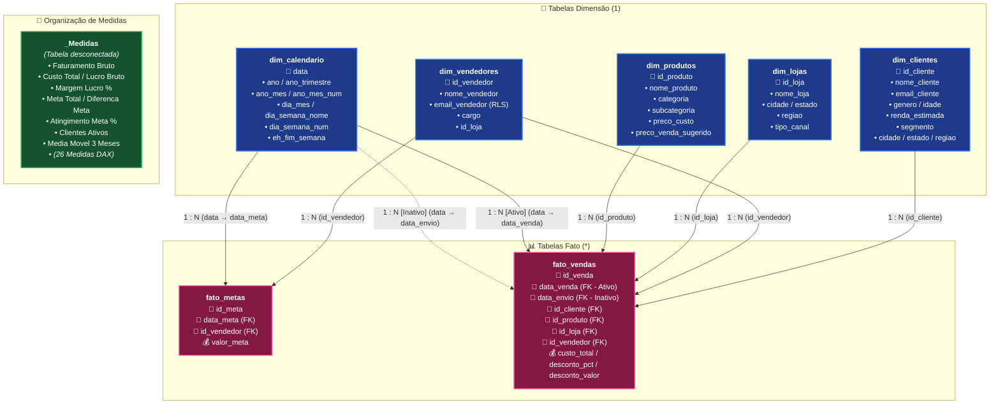

# 🏆 Projeto Prático Completo Power BI — Preparatório Certificação PL-300
### Microsoft Certified: Power BI Data Analyst Associate

[](https://powerbi.microsoft.com/)
[](https://learn.microsoft.com/dax/)
[](https://learn.microsoft.com/power-query/)
[](https://www.mysql.com/)
[](https://www.docker.com/)
[](LICENSE)

---

## 📖 Sobre Este Repositório

Este repositório contém um **projeto prático completo de ponta a ponta** desenvolvido especificamente para capacitar pessoas que **nunca utilizaram o Power BI** ou que desejam conquistar a certificação oficial **Microsoft Certified: Power BI Data Analyst Associate (PL-300)**.

O projeto aborda um cenário real de negócios de uma grande rede varejista omnichannel (**Tech & Home Brasil**), contendo mais de **84.000 transações comerciais**, modelagem dimensional em **Esquema Estrela (Star Schema)**, **26 medidas DAX comentadas com alternativas e justificativas técnicas**, **Segurança em Nível de Linha (RLS Estático e Dinâmico)**, **3 painéis interativos de alto padrão visual (UI/UX)** e todas as diretrizes de governança e publicação no **Power BI Service**.

---

## 🎯 Objetivos de Aprendizagem (Cobertura 100% PL-300)

O projeto cobre rigorosamente os 4 grandes domínios exigidos no exame oficial da Microsoft:

```
+-----------------------------------------------------------------------------------+
|  1. Preparar os Dados (Power Query / M)                   | 25% - 30% da Prova    |
|  2. Modelar os Dados (Star Schema, Relacionamentos e DAX) | 25% - 30% da Prova    |
|  3. Visualizar e Analisar os Dados (Relatórios, KPIs e UX)| 25% - 30% da Prova    |
|  4. Implantar e Manter Ativos (Power BI Service e RLS)    | 15% - 20% da Prova    |
+-----------------------------------------------------------------------------------+
```

---

## 🏢 Cenário de Negócio: *Tech & Home Brasil*

- **Operação:** Venda de produtos de Tecnologia, Eletrodomésticos, Móveis e Utilidades Domésticas.
- **Estrutura:** 14 Lojas Físicas nas 5 regiões do Brasil + 1 Canal Digital Nacional (E-Commerce e Marketplace).
- **Equipe:** 25 Vendedores com metas individuais mensais.
- **Base Transacional:** ~84.250 vendas entre 2023 e 2025, totalizando mais de R$ 180 milhões em vendas.

---

## 📐 Arquitetura de Dados (Star Schema)

O modelo dimensional foi desenhado seguindo as melhores práticas recomendadas pela Microsoft para o **Exame PL-300**, utilizando um **Esquema Estrela (Star Schema)** puro com filtros unidirecionais (`1 ──► *`), uma dimensão de interpretação múltipla (*Role-Playing Dimension* via `USERELATIONSHIP`) e uma tabela técnica desconectada para organização das medidas DAX.



### 🔗 Matriz de Relacionamentos do Modelo

| Tabela Origem (Fato) | Coluna FK | Cardinalidade | Tabela Destino (Dimensão) | Coluna PK | Direção do Filtro | Status | Observação / Caso de Uso |
| :--- | :--- | :---: | :--- | :--- | :---: | :---: | :--- |
| `fato_vendas` | `id_cliente` | `* : 1` | `dim_clientes` | `id_cliente` | Único (`dim ➔ fato`) | **Ativo** | Análise de perfil, faixa etária e segmentação |
| `fato_vendas` | `id_produto` | `* : 1` | `dim_produtos` | `id_produto` | Único (`dim ➔ fato`) | **Ativo** | Análise por categorias, subcategorias e margem |
| `fato_vendas` | `id_loja` | `* : 1` | `dim_lojas` | `id_loja` | Único (`dim ➔ fato`) | **Ativo** | Desempenho regional e vendas físicas vs digital |
| `fato_vendas` | `id_vendedor` | `* : 1` | `dim_vendedores` | `id_vendedor` | Único (`dim ➔ fato`) | **Ativo** | Comissionamento, ranking e RLS por vendedor |
| `fato_vendas` | `data_venda` | `* : 1` | `dim_calendario` | `data` | Único (`dim ➔ fato`) | **Ativo** | Inteligência temporal padrão (Vendas / YTD / SPLY) |
| `fato_vendas` | `data_envio` | `* : 1` | `dim_calendario` | `data` | Único (`dim ➔ fato`) | **Inativo** | Role-Playing Dimension ativado via `USERELATIONSHIP` |
| `fato_metas` | `id_vendedor` | `* : 1` | `dim_vendedores` | `id_vendedor` | Único (`dim ➔ fato`) | **Ativo** | Metas individuais por vendedor |
| `fato_metas` | `data_meta` | `* : 1` | `dim_calendario` | `data` | Único (`dim ➔ fato`) | **Ativo** | Metas mensais ao longo da linha do tempo |
| `_Medidas` | *N/A* | *N/A* | *N/A* | *N/A* | *N/A* | **Desconectada** | Tabela dedicada exclusivamente para repositório DAX |

---

## 📂 Estrutura do Repositório

```text
├── Guia_Pratico_PL300_Projeto_Completo_Didatico.md # 📘 O Manual didático completo passo a passo com resolução
├── Plano de Estudos PL-300.md                      # 🗓️ Roteiro de estudos estruturado para a prova
├── ExercicioPBI_MySQL.pbix                         # 📊 Arquivo Power BI com a solução completa construída
├── docker-compose.yml                              # 🐳 Orquestração do MySQL local com carga automática
├── README.md                                       # 📄 Documentação principal do repositório
└── dados/                                          # 📁 Base de dados pronta para uso
    ├── dim_calendario.csv                          # Tabela de datas contínuas (2023 a 2025)
    ├── dim_clientes.csv                            # Cadastro de 1.200 clientes com renda e segmento
    ├── dim_lojas.csv                               # 14 lojas físicas e canal digital
    ├── dim_produtos.csv                            # 34 produtos com custos e categorias
    ├── dim_vendedores.csv                          # 25 vendedores com e-mail corporativo para RLS
    ├── fato_metas.csv                              # 900 metas mensais por vendedor
    ├── fato_vendas.csv                             # 84.251 vendas transacionais
    ├── schema_pl300_varejo.sql                     # Script SQL para criação e carga no MySQL
    └── gerar_dados.py                              # Script Python que gerou os dados sintéticos
```

---

## 🚀 Como Reproduzir Este Projeto Localmente

Você pode executar e praticar este projeto utilizando **uma das opções abaixo**:

---

### Opção 1: Modo Rápido com Arquivos CSV (Zero Instalação de Banco de Dados)
> **Recomendado para iniciantes** ou para quem não deseja instalar servidores de banco de dados.

1. **Baixe ou Clone este repositório:**
   ```bash
   git clone https://github.com/SEU_USUARIO/powerbi-pl300-projeto-completo.git
   ```
2. **Abra o Power BI Desktop** (baixe gratuitamente na [Microsoft Store](https://apps.microsoft.com/detail/9NT1R1C2HH7J)).
3. Clique em **Obter Dados (Get Data) → Texto/CSV**.
4. Navegue até a pasta `dados/` e selecione `dim_clientes.csv`.
   - *Origem do arquivo:* `65001: Unicode (UTF-8)`
   - *Delimitador:* `Ponto e vírgula (;)`
5. Clique em **Transformar Dados (Transform Data)**.
6. Dentro do Power Query, importe os demais 6 arquivos CSV da pasta `dados/`.
7. Siga as instruções detalhadas no [Guia Prático Didático](Guia%20Pratico%20PL300%20Projeto%20Completo%20Didatico.md).

---

### Opção 2: Modo com Docker (1 Comando para subir o MySQL + Base Completa)
> **Recomendado para praticar conexão com banco relacional** sem precisar instalar o MySQL manualmente.

1. **Pré-requisito:** Ter o [Docker Desktop](https://www.docker.com/products/docker-desktop/) instalado na máquina.
2. Na raiz do projeto, execute o comando no terminal:
   ```bash
   docker compose up -d
   ```
   *O Docker baixará o MySQL 8.0 e executará automaticamente o script `schema_pl300_varejo.sql`, criando o banco `pl300_varejo` já 100% populado com as 84.000+ linhas.*

3. **Credenciais de Conexão:**
   - **Servidor:** `localhost:3306` (ou `127.0.0.1:3306`)
   - **Banco de Dados:** `pl300_varejo`
   - **Usuário:** `root`
   - **Senha:** `pl300_password!#`

4. No **Power BI Desktop**, vá em **Obter Dados → Banco de Dados MySQL**, insira as credenciais acima, marque as 7 tabelas e clique em **Transformar Dados**.

---

### Opção 3: Modo MySQL Server Local (MySQL Workbench / DBeaver)

Se você já possui um servidor MySQL instalado na sua máquina:

1. Abra o **MySQL Workbench** ou **DBeaver** e conecte-se ao seu servidor local.
2. Abra o arquivo `dados/schema_pl300_varejo.sql`.
3. Execute o script completo (ele criará o database `pl300_varejo`, criará as tabelas com chaves primárias/estrangeiras e inserirá todas as linhas).
4. No Power BI Desktop, conecte-se ao seu servidor informando seu usuário e senha locais.

> [!TIP]
> Se o Power BI exibir uma mensagem solicitando o conector MySQL, instale o [MySQL Connector/NET](https://dev.mysql.com/downloads/connector/net/) oficial da Oracle para Windows.

---

### Opção 4: Como Gerar Novos Dados ou Customizar o Volume (Python)

Caso queira gerar um volume diferente de dados (ex.: 500.000 vendas ou outros períodos), você pode executar o script gerador:

```bash
# Navegue até a pasta de dados e execute o script
python dados/gerar_dados.py
```
O script utiliza apenas módulos nativos do Python (`csv`, `random`, `datetime`, `os`) e atualizará tanto os arquivos `.csv` quanto o script `.sql`.

---

## 🧭 Roteiro de Estudos Sugerido

Para extrair o máximo de aprendizado deste projeto:

1. 📖 **Leia o Manual Completo:** Abra o arquivo [Guia_Pratico_PL300_Projeto_Completo_Didatico.md](Guia%20Pratico%20PL300%20Projeto%20Completo%20Didatico.md).
2. 🛠️ **Mão na Massa:** Abra um novo arquivo em branco no Power BI Desktop e execute cada etapa:
   - **Etapa 1:** Profilagem e limpeza no Power Query.
   - **Etapa 2:** Modelagem dos relacionamentos e marcação de tabela de datas.
   - **Etapa 3:** Criação das 26 medidas DAX (leia as explicações de *por que* foram criadas assim e as alternativas de código).
   - **Etapa 4:** Teste de RLS Estático e RLS Dinâmico.
   - **Etapa 5:** Montagem dos 3 painéis visuais com Tooltips, Bookmarks e Drill-through.
   - **Etapa 6:** Revisão dos conceitos de Gateway, Atualização Agendada e Workspace Roles.
3. 🔍 **Gabarito Oficial:** Caso queira comparar o seu resultado final com a referência, abra o arquivo [ExercicioPBI_MySQL.pbix](ExercicioPBI_MySQL.pbix) incluído neste repositório.

---

## 📊 Medidas DAX Desenvolvidas no Projeto

Todas as 26 medidas estão catalogadas, comentadas e explicadas no [Guia Didático](Guia%20Pratico%20PL300%20Projeto%20Completo%20Didatico.md), divididas em 5 níveis de complexidade:

1. **Nível 1 — Agregações Básicas:** `Faturamento Bruto`, `Receita Liquida`, `Custo Total`, `Lucro Bruto`, `Margem Lucro %`, `Qtd Itens Vendidos`, `Total Pedidos`, `Ticket Medio`, `Clientes Ativos`.
2. **Nível 2 — Modificadores de Filtro:** `Receita Total Geral` (`ALL`/`REMOVEFILTERS`), `Share Receita %` (`ALLSELECTED`), `Receita Online`, `Receita Desconto Alto` (`KEEPFILTERS`).
3. **Nível 3 — Inteligência Temporal (Time Intelligence):** `Receita YTD` (`TOTALYTD`/`DATESYTD`), `Receita SPLY` (`SAMEPERIODLASTYEAR`/`DATEADD`), `Variacao YoY Valor`, `Variacao YoY %`, `Receita Mes Anterior` (`PREVIOUSMONTH`), `Variacao MoM %` (com `VAR`/`RETURN`), `Media Movel 3 Meses` (`AVERAGEX` + `DATESINPERIOD`).
4. **Nível 4 — Role-Playing Dimensions & Logística:** `Receita por Data de Envio` (`USERELATIONSHIP`), `Tempo Medio Despacho Dias` (`AVERAGEX` + `DATEDIFF`).
5. **Nível 5 — Gestão Comercial & Rankings:** `Meta Total`, `Diferenca Meta`, `Atingimento Meta %`, `Ranking Vendedor` (`RANKX` + `ISINSCOPE`).

---

## 🤝 Como Contribuir

Contribuições são extremamente bem-vindas! Se você encontrou algum erro, deseja sugerir uma nova medida DAX, adicionar novos exercícios ou aprimorar os gráficos:

1. Faça um **Fork** deste repositório.
2. Crie uma Branch para sua modificação: `git checkout -b feature/nova-funcionalidade`.
3. Commit suas alterações: `git commit -m 'Adiciona novo exercício de DAX'`.
4. Faça o Push para a sua Branch: `git push origin feature/nova-funcionalidade`.
5. Abra um **Pull Request**.

---

## 📜 Licença

Este projeto está sob a licença **MIT** — sinta-se livre para utilizar, modificar e compartilhar para fins de estudo, cursos ou projetos profissionais.

---

<p align="center">
  <b>Bons estudos e rumo à aprovação na certificação PL-300! 🚀</b>
</p>
